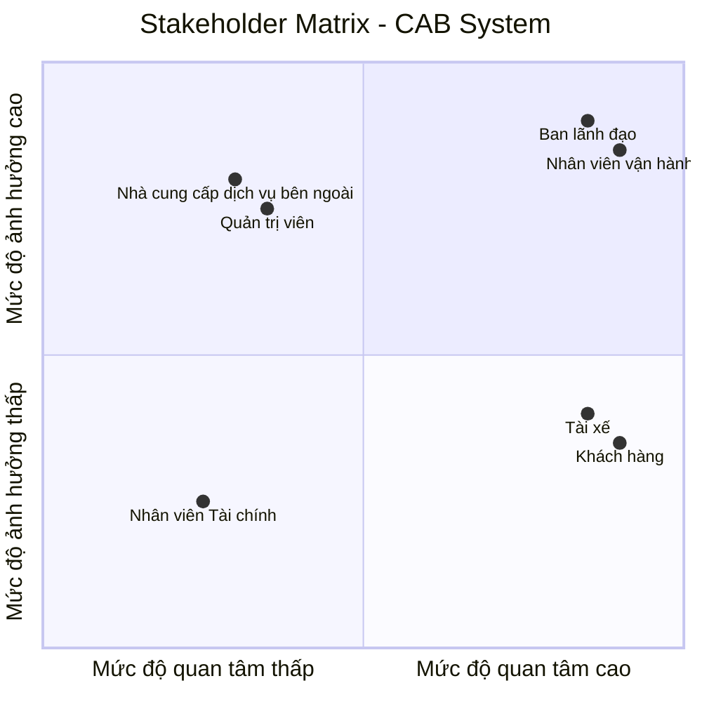
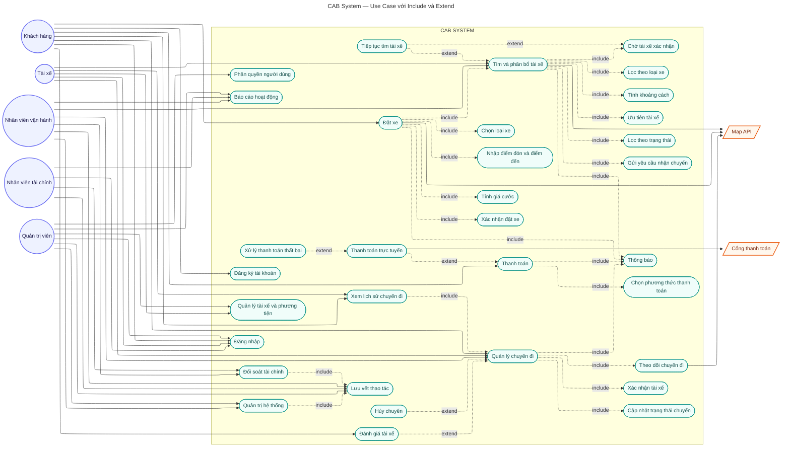
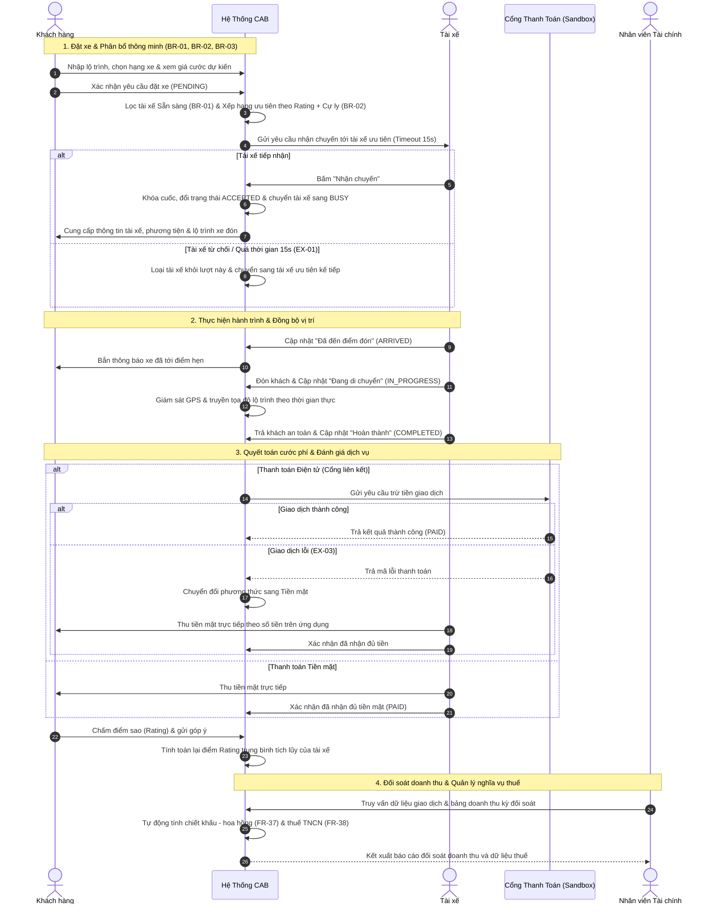
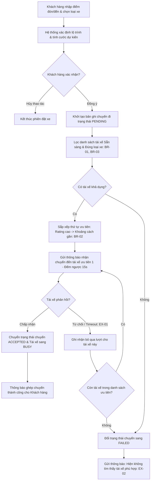
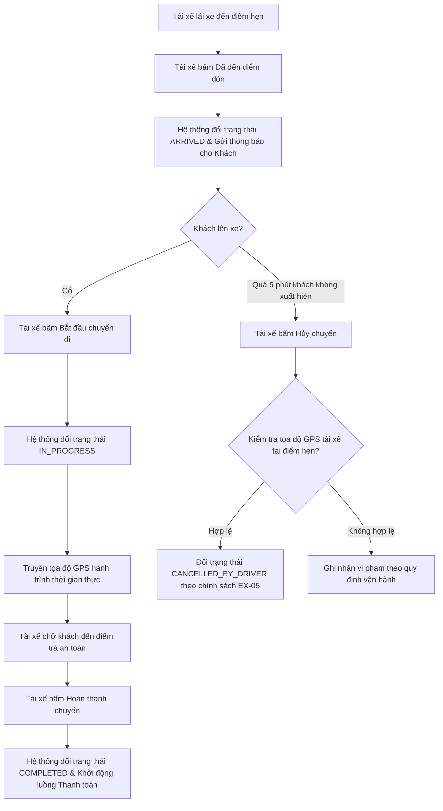
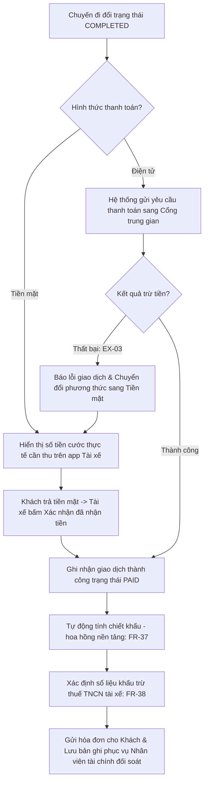

### 23630811_VOTHIMYXUYEN_CABSYSTEM
## BƯỚC 1: HIỂU NGHIỆP VỤ, LÝ DO HỆ THỐNG CŨ KHÔNG ĐÁP ỨNG ĐƯỢC, GIẢI PHÁP MỚI, CÁC BÊN THAM GIA VÀ GIÁ TRỊ KINH DOANH
# 1. Bối cảnh nghiệp vụ và lý do hệ thống cũ không đáp ứng được

**Quy trình điều phối thủ công:**  
Khách hàng hiện tại chủ yếu đặt xe qua tổng đài hoặc một ứng dụng sơ khai; việc gán và tìm tài xế phải làm thủ công, gây độ trễ lớn và dễ sai sót.

**Trải nghiệm khách hàng còn hạn chế:**  
Khách hàng không thể theo dõi trực quan vị trí thời gian thực của xe, trạng thái chuyến đi hoặc thời gian dự kiến tài xế đến.

**Quản lý dữ liệu thanh toán phân tán:**  
Dữ liệu thanh toán chưa được lưu trữ tập trung, thiếu khả năng kết nối cổng thanh toán trực tuyến bảo mật và linh hoạt.

**Khả năng mở rộng kém (Scalability kém):**  
Hệ thống không đáp ứng được khi lưu lượng khách hàng và tài xế tăng cao vào giờ cao điểm, gây nghẽn và khó phát triển thêm tính năng mới.

## 2. Giải pháp mới và hệ thống mới (Nền tảng CAB System)
**Tự động hóa hoàn toàn quy trình:**  
Xây dựng nền tảng CAB thông minh tự động kết nối cuốc xe theo định vị GPS, đề xuất tài xế phù hợp gần nhất, tự động chuyển lượt khi tài xế từ chối và tính cước tự động.

**Kiến trúc module hóa độc lập:**  
Hệ thống phân tách thành các module riêng biệt như Đặt chuyến, Định vị, Thanh toán, Thông báo và Quản trị; đảm bảo sự cố ở một module không làm tê liệt toàn bộ nền tảng.

## 3. Các đối tượng tham gia hệ thống

**Khách hàng:**  
Đăng ký/đăng nhập tài khoản, nhập điểm đón/đến, chọn loại dịch vụ xe, tạo yêu cầu đặt xe, theo dõi lộ trình trực tiếp, thanh toán và đánh giá tài xế sau chuyến.

**Tài xế:**  
Đăng ký hồ sơ và phương tiện, bật/tắt trạng thái sẵn sàng, nhận hoặc từ chối cuốc xe, cập nhật trạng thái di chuyển và truyền tọa độ vị trí theo thời gian thực.

**Nhân viên vận hành:**  
Sử dụng cổng thông tin quản trị để giám sát các chuyến đi đang diễn ra, kiểm tra trạng thái hoạt động của tài xế và hỗ trợ xử lý sự cố cuốc xe.

**Quản trị hệ thống:**  
Quản lý phân quyền người dùng, cấu hình tham số hệ thống, giám sát an ninh dữ liệu và lưu vết nhật ký hệ thống.

**Ban lãnh đạo:**  
Khai thác các báo cáo tổng hợp về doanh thu, số lượng cuốc hoàn thành, tỷ lệ hủy chuyến và hiệu suất vận hành của đội ngũ tài xế.

**Nhân viên Tài chính:**
Tra cứu và đối soát giao dịch, theo dõi doanh thu, tính/đối soát chiết khấu – hoa hồng và quản lý thông tin thuế của tài xế theo chính sách doanh nghiệp.

**Hệ thống bên thứ ba:**  
Cổng thanh toán điện tử trung gian, dịch vụ bản đồ số (Map API) và hạ tầng gửi thông báo (Push/SMS).

## 4. Giá trị kinh doanh của hệ thống mới

**Tối ưu chi phí và nguồn lực vận hành:**  
Giảm thiểu tối đa sự can thiệp thủ công từ tổng đài viên, tự động hóa quy trình ghép cuốc giúp tối ưu chi phí nhân sự.

**Gia tăng năng lực cạnh tranh và doanh thu:**  
Cho phép phục vụ số lượng lớn chuyến đi cùng lúc, hỗ trợ mở rộng nhanh chóng các loại hình dịch vụ vận chuyển mới.

**Nâng cao sự hài lòng và giữ chân khách hàng:**  
Minh bạch lộ trình, giá cước và rút ngắn thời gian chờ xe; đảm bảo an toàn tuyệt đối cho dữ liệu thông tin cá nhân và giao dịch.

## BƯỚC 2: XÁC ĐỊNH STAKEHOLDER, VAI TRÒ VÀ THIẾT LẬP STAKEHOLDER MATRIX
| STT | Stakeholder | Vai trò |
|:---:|---|---|
| 1 | **Ban lãnh đạo** | Định hướng chiến lược, phê duyệt ngân sách và theo dõi hiệu quả hoạt động của hệ thống. |
| 2 | **Khách hàng** | Đặt chuyến, thanh toán và theo dõi hành trình. |
| 3 | **Tài xế** | Nhận chuyến, thực hiện di chuyển và cập nhật trạng thái chuyến đi. |
| 4 | **Nhân viên vận hành** | Theo dõi cuốc xe, quản lý hoạt động tài xế và xử lý sự cố, khiếu nại khách hàng. |
| 5 | **Quản trị viên** | Quản lý tài khoản, phân quyền, cấu hình hệ thống, kiểm soát quyền truy cập và theo dõi nhật ký hệ thống. |
| 6 | **Nhân viên Tài chính** | Đối soát giao dịch, theo dõi doanh thu và quản lý dữ liệu thanh toán. |
| 7 | **Nhà cung cấp dịch vụ bên ngoài (Payment Gateway & Map Providers)** | Xử lý thanh toán trực tuyến và cung cấp dịch vụ bản đồ, định vị. |

## 3. Ma trận Stakeholder Matrix (Phân loại theo Mức độ ảnh hưởng và Quan tâm)

## BƯỚC 3: MỤC ĐÍCH NGHIỆP VỤ

**1. Tự động hóa toàn diện quy trình điều phối & kết nối cuốc xe**

* Chuyển đổi hoàn toàn từ mô hình đặt xe thủ công qua tổng đài sang thuật toán điều phối tự động dựa trên tọa độ vị trí thời gian thực (GPS), độ sẵn sàng và khoảng cách gần nhất của tài xế.
* Tối ưu hóa thời gian chờ đợi của khách hàng và thời gian phản hồi cuốc xe của tài xế, giảm tải chi phí và nhân lực vận hành.

**2. Đáp ứng tải lớn và năng lực mở rộng phục vụ quy mô cao**

* Phục vụ đồng thời số lượng lớn khách hàng và tài xế trong các khung giờ cao điểm mà không gây nghẽn hoặc gián đoạn dịch vụ.
* Đảm bảo tính sẵn sàng cao thông qua kiến trúc module độc lập; lỗi phát sinh ở một thành phần riêng lẻ không làm ảnh hưởng đến toàn bộ chu trình đặt xe.

**3. Đa dạng hóa và bảo mật phương thức thanh toán**

* Hỗ trợ song song cả hai hình thức thanh toán linh hoạt: tiền mặt trực tiếp cho tài xế và thanh toán điện tử (thẻ ngân hàng, ví điện tử) qua cổng thanh toán trung gian.
* Đảm bảo an toàn bảo mật tuyệt đối: tích hợp thanh toán qua bên thứ ba và không lưu trữ thông tin thẻ hoặc tài khoản nhạy cảm trực tiếp trên hệ thống.

**4. Minh bạch trải nghiệm và nâng cao chất lượng dịch vụ**

* Giúp khách hàng chủ động theo dõi toàn bộ hành trình, vị trí thực tế của xe, thời gian dự kiến đón và biết trước giá cước ước tính trước khi xác nhận đặt.
* Cung cấp cơ chế đánh giá sao, nhận xét chất lượng tài xế sau mỗi chuyến đi để duy trì chất lượng dịch vụ đồng đều.

**5. Chuẩn hóa & tập trung hóa dữ liệu phục vụ quản trị, ra quyết định**

* Quản lý tập trung hồ sơ khách hàng, đối tác tài xế, thông tin phương tiện và lịch sử toàn bộ các chuyến đi/giao dịch.
* Cung cấp số liệu báo cáo thời gian thực cho Ban lãnh đạo về doanh thu, số lượng cuốc hoàn thành, tỷ lệ hủy chuyến và hiệu suất hoạt động để hoạch định chiến lược kinh doanh.
* Quản lý tập trung dữ liệu giao dịch, doanh thu, chiết khấu – hoa hồng và thông tin thuế của tài xế, phục vụ công tác đối soát và quản lý tài chính.

# BƯỚC 4: XÁC ĐỊNH PHẠM VI DỰ ÁN
## 1. Mục tiêu phạm vi
### Trong phạm vi (In-Scope)
 Hệ thống đặt xe cơ bản: nhập điểm đón, điểm đến và lựa chọn loại xe.
Tìm kiếm và phân bổ tài xế phù hợp.
Tài xế nhận/từ chối chuyến và cập nhật trạng thái chuyến.
Theo dõi trạng thái và vị trí tài xế.
Tính và xác định cước chuyến đi; thanh toán bằng tiền mặt hoặc phương thức điện tử.
Tích hợp nhà cung cấp thanh toán bên ngoài thông qua môi trường Sandbox.
Quản lý lịch sử chuyến đi và đánh giá tài xế.
Gửi thông báo cho khách hàng và tài xế.
Quản lý khách hàng, tài xế, phương tiện và chuyến đi.
Quản lý và đối soát giao dịch thanh toán, doanh thu, chiết khấu – hoa hồng và thông tin thuế của tài xế.
Báo cáo số lượng chuyến, doanh thu, tỷ lệ hoàn thành, tỷ lệ hủy và hiệu quả tài xế.
Phân quyền người dùng và lưu vết các thao tác quan trọng.

### Ngoài phạm vi (Out-of-Scope)
- Triển khai thanh toán thực tế trên môi trường Production; trong phạm vi dự án chỉ tích hợp và kiểm thử thông qua môi trường Sandbox.
- Các tính năng nâng cao: đặt xe ghép, giao hàng, đặt trước chuyến đi.
- Đặt nhiều điểm đến trong một chuyến.
- Chương trình tích điểm, khuyến mãi, voucher/mã giảm giá.
- Ví điện tử riêng của CAB.
- Quản lý lương, chấm công và nhân sự tài xế.
- Hệ thống kế toán, tài chính chuyên sâu.
## 2. Các module trong phạm vi dự án
### Module 1: Xác thực

- Đăng ký tài khoản.
- Đăng nhập.
- Đăng xuất.
- Xác thực tài khoản.
- Mã hóa mật khẩu.
- Phân quyền theo vai trò.

### Module 2: Quản lý người dùng

- Quản lý thông tin tài khoản.
- Cập nhật thông tin cá nhân.
- Quản lý trạng thái tài khoản.
- Quản lý vai trò người dùng.

### Module 3: Quản lý tài xế

- Quản lý thông tin tài xế.
- Quản lý thông tin phương tiện.
- Cập nhật trạng thái sẵn sàng nhận chuyến.
- Tiếp nhận chuyến.
- Từ chối chuyến.

### Module 4: Quản lý đặt xe

- Nhập điểm đón.
- Nhập điểm đến.
- Chọn loại xe.
- Xem giá cước dự kiến.
- Tạo yêu cầu đặt xe.
- Tìm và phân bổ tài xế.
- Hủy chuyến.

### Module 5: Quản lý chuyến đi

- Quản lý trạng thái chuyến.
- Xác nhận tài xế nhận chuyến.
- Cập nhật trạng thái:
  - Đã nhận chuyến.
  - Đã đến điểm đón.
  - Đã đón khách.
  - Đang di chuyển.
  - Hoàn thành chuyến.
- Theo dõi chuyến đi.

### Module 6: Quản lý bản đồ và định vị

- Xác định vị trí khách hàng.
- Xác định vị trí tài xế.
- Hiển thị điểm đón và điểm đến.
- Hiển thị vị trí tài xế trên bản đồ.
- Theo dõi vị trí tài xế trong quá trình di chuyển.

### Module 7: Quản lý thanh toán

- Thanh toán bằng tiền mặt.
- Thanh toán trực tuyến.
- Ghi nhận trạng thái thanh toán.
- Lưu thông tin giao dịch.
- Xử lý trường hợp thanh toán điện tử thất bại theo chính sách của doanh nghiệp.

### Module 8: Quản lý lịch sử và đánh giá

- Xem lịch sử chuyến đi.
- Xem chi tiết chuyến đi.
- Xem chi phí chuyến đi.
- Đánh giá tài xế.
- Lưu nhận xét và số sao.

### Module 9: Quản trị hệ thống

- Quản lý tài khoản người dùng.
- Quản lý tài khoản tài xế.
- Quản lý chuyến đi.
- Theo dõi trạng thái tài xế và các chuyến đang diễn ra.
- Tra cứu thông tin và lịch sử.

### Module 10: Quản lý thông báo
- Gửi thông báo cho khách hàng khi yêu cầu đặt xe được tiếp nhận.
- Thông báo khi tài xế nhận chuyến.
- Thông báo khi tài xế đến điểm đón.
- Thông báo khi chuyến hoàn thành.
- Thông báo kết quả thanh toán.
- Gửi thông báo cho tài xế khi có chuyến mới.
- Gửi thông báo khi có thay đổi liên quan đến chuyến đang thực hiện.
- Hỗ trợ mở rộng thêm các kênh thông báo trong tương lai.

### Module 11: Báo cáo
- Báo cáo số lượng chuyến.
- Báo cáo doanh thu.
- Báo cáo tỷ lệ chuyến hoàn thành.
- Báo cáo tỷ lệ chuyến hủy.
- Báo cáo hiệu quả hoạt động của tài xế.
- Báo cáo doanh thu.
- Báo cáo chiết khấu – hoa hồng.
- Báo cáo thuế tài xế.

## 3. Các đối tượng dữ liệu chính

Hệ thống quản lý các đối tượng dữ liệu cơ bản:

|       Đối tượng      | Nội dung quản lý                                               |
| :------------------: | -------------------------------------------------------------- |
|    **Người dùng**    | Tài khoản, thông tin cá nhân và vai trò                        |
|      **Tài xế**      | Thông tin tài xế và trạng thái hoạt động                       |
|    **Phương tiện**   | Loại xe, biển số và thông tin phương tiện                      |
|  **Yêu cầu đặt xe**  | Điểm đón, điểm đến, loại xe và trạng thái yêu cầu              |
|     **Chuyến xe**    | Khách hàng, tài xế, điểm đón, điểm đến, trạng thái và giá cước |
|    **Thanh toán**    | Phương thức, số tiền và trạng thái thanh toán                  |
|     **Đánh giá**     | Số sao và nhận xét của khách hàng                              |
|     **Thông báo**    | Nội dung, người nhận, thời điểm và trạng thái thông báo        |
| **Nhật ký hệ thống** | Thao tác quan trọng, người thực hiện và thời điểm              |
| **Giao dịch thanh toán** | Số tiền, phương thức, trạng thái và thời gian giao dịch            |
| **Chiết khấu – hoa hồng** | Tỷ lệ/mức chiết khấu, hoa hồng và số tiền đối soát            |
| **Thông tin thuế tài xế** | Thông tin và số liệu thuế liên quan đến tài xế         |

# 4. Kế hoạch thực hiện trong 7 tuần
|    Tuần    | Nội dung thực hiện                                                                            | Kết quả cần đạt                                                                  |
| :--------: | --------------------------------------------------------------------------------------------- | -------------------------------------------------------------------------------- |
| **Tuần 1** | Phân tích yêu cầu, xác định phạm vi, thiết kế cơ sở dữ liệu và kiến trúc hệ thống.            | Hoàn thiện yêu cầu, sơ đồ nghiệp vụ, cơ sở dữ liệu và thiết kế tổng thể.         |
| **Tuần 2** | Xây dựng **Module Xác thực** và **Module Quản lý người dùng**.                                | Người dùng có thể đăng ký, đăng nhập, đăng xuất và được phân quyền.              |
| **Tuần 3** | Xây dựng **Module Quản lý tài xế** và **Module Quản lý phương tiện**.                         | Tài xế có hồ sơ, phương tiện và trạng thái sẵn sàng nhận chuyến.                 |
| **Tuần 4** | Xây dựng **Module Quản lý đặt xe** và **Module Quản lý chuyến đi**.                           | Khách hàng có thể đặt xe và tài xế có thể nhận, từ chối và cập nhật chuyến.      |
| **Tuần 5** | Xây dựng **Module Bản đồ & Định vị** và **Module Thông báo**.                                 | Hiển thị vị trí, theo dõi tài xế và gửi thông báo theo các sự kiện của hệ thống. |
| **Tuần 6** | Xây dựng **Module Thanh toán**, **Lịch sử & Đánh giá**, **Quản trị hệ thống** và **Báo cáo**. | Hoàn thành thanh toán, lịch sử, đánh giá, quản trị và báo cáo cơ bản.            |
| **Tuần 7** | Tích hợp toàn bộ module, kiểm thử, sửa lỗi và hoàn thiện hệ thống.                            | Hệ thống hoạt động theo quy trình đặt xe trực tuyến cơ bản.                      |

# BƯỚC 5: CHUYỂN YÊU CẦU NGHIỆP VỤ (BUSINESS REQUIREMENTS) THÀNH YÊU CẦU HỆ THỐNG

| Mã BP | Quy trình nghiệp vụ | Yêu cầu nghiệp vụ (Business Requirement) | Yêu cầu hệ thống (System Requirement) |
| :---: | :--- | :--- | :--- |
| **BP-01** | **Đăng nhập và đặt xe** | Khách hàng có thể đăng nhập và tạo yêu cầu đặt xe trực tuyến. | Hệ thống cho phép khách hàng đăng nhập; nhập điểm đón; nhập điểm đến; chọn loại xe; hiển thị giá cước dự kiến; xác nhận và tạo yêu cầu đặt xe. |
| **BP-02** | **Tìm và phân bổ tài xế** | Hệ thống tìm và phân bổ tài xế phù hợp cho yêu cầu đặt xe. | Hệ thống kiểm tra tài xế đang sẵn sàng; xác định tài xế phù hợp dựa trên vị trí và các tiêu chí vận hành; gửi yêu cầu chuyến đến tài xế; ghi nhận việc tài xế nhận, từ chối hoặc không phản hồi; tiếp tục tìm tài xế khác khi cần; thông báo kết quả cho khách hàng. |
| **BP-03** | **Tài xế nhận và thực hiện chuyến** | Tài xế có thể nhận và thực hiện chuyến xe. | Hệ thống hiển thị thông tin chuyến cho tài xế; hiển thị điểm đón và điểm đến; cho phép tài xế nhận hoặc từ chối chuyến; cho phép tài xế cập nhật trạng thái đã đến điểm đón, đã đón khách, đang di chuyển và hoàn thành chuyến. |
| **BP-04** | **Theo dõi chuyến đi** | Khách hàng có thể theo dõi tình trạng chuyến và vị trí tài xế trong quá trình thực hiện chuyến. | Hệ thống hiển thị thông tin tài xế; hiển thị vị trí tài xế trên bản đồ; cập nhật trạng thái chuyến; cập nhật vị trí tài xế trong quá trình di chuyển; cho phép khách hàng theo dõi quá trình di chuyển. |
| **BP-05** | **Tính cước và thanh toán** | Khách hàng có thể thanh toán chi phí chuyến đi bằng tiền mặt hoặc phương thức thanh toán điện tử. | Hệ thống xác định số tiền khách hàng phải trả; hỗ trợ thanh toán bằng tiền mặt; hỗ trợ thanh toán điện tử thông qua nhà cung cấp bên ngoài; ghi nhận trạng thái giao dịch; lưu thông tin giao dịch; thông báo kết quả thanh toán; xử lý trường hợp thanh toán thất bại theo chính sách của doanh nghiệp. |
| **BP-06** | **Hoàn thành chuyến và đánh giá** | Sau khi chuyến đi hoàn thành, khách hàng có thể đánh giá tài xế. | Hệ thống xác nhận chuyến đi hoàn thành; lưu thông tin chuyến đi; cho phép khách hàng đánh giá tài xế bằng số sao và nhận xét; lưu kết quả đánh giá. |
| **BP-07** | **Tra cứu lịch sử chuyến đi** | Khách hàng và tài xế có thể xem lại lịch sử các chuyến đã thực hiện. | Hệ thống lưu thông tin chuyến đi, điểm đón, điểm đến, khách hàng, tài xế, cước phí và trạng thái thanh toán; cho phép khách hàng và tài xế tra cứu lịch sử chuyến đi. |
| **BP-08** | **Thông báo** | Khách hàng và tài xế nhận được thông báo về các sự kiện liên quan đến chuyến đi và thanh toán. | Hệ thống gửi thông báo cho khách hàng khi yêu cầu đặt xe được tiếp nhận, tài xế nhận chuyến, tài xế đến điểm đón, chuyến hoàn thành và thanh toán có kết quả; gửi thông báo cho tài xế khi có chuyến mới hoặc thay đổi liên quan đến chuyến đang thực hiện; hỗ trợ mở rộng thêm các kênh thông báo trong tương lai. |
| **BP-09** | **Vận hành và quản trị** | Nhân viên vận hành có thể quản lý và hỗ trợ xử lý các hoạt động của hệ thống. | Hệ thống cho phép quản lý khách hàng, tài xế, phương tiện và chuyến đi; xem các chuyến đang diễn ra; kiểm tra trạng thái tài xế; hỗ trợ xử lý các trường hợp chuyến bị lỗi; tra cứu lịch sử giao dịch; kiểm soát quyền truy cập đối với các chức năng quản trị. |
| **BP-10** | **Đối soát tài chính** | Nhân viên tài chính có thể tra cứu giao dịch, đối soát doanh thu, tính chiết khấu – hoa hồng và quản lý thông tin thuế tài xế. | Hệ thống cho phép nhân viên tài chính tra cứu giao dịch; tổng hợp doanh thu; tính/đối soát chiết khấu – hoa hồng theo chính sách doanh nghiệp; quản lý và tra cứu thông tin thuế của tài xế; xuất/tra cứu dữ liệu phục vụ đối soát. |
| **BP-11** | **Báo cáo hoạt động** | Ban lãnh đạo có thể theo dõi tình hình và hiệu quả hoạt động của hệ thống. | Hệ thống cung cấp báo cáo về số lượng chuyến, doanh thu, tỷ lệ chuyến hoàn thành, tỷ lệ hủy và hiệu quả hoạt động của tài xế. |

## 5.1. Các trường hợp ngoại lệ cần xác nhận

| Mã | Trường hợp | Yêu cầu xử lý |
| :---: | :--- | :--- |
| **EX-01** | Tài xế từ chối hoặc không phản hồi | Hệ thống tiếp tục tìm tài xế phù hợp khác mà không yêu cầu khách hàng tạo lại yêu cầu đặt xe. |
| **EX-02** | Không tìm được tài xế | Hệ thống thông báo rõ ràng cho khách hàng rằng chưa tìm được tài xế phù hợp. |
| **EX-03** | Thanh toán điện tử thất bại | Hệ thống thông báo kết quả cho khách hàng và cho phép xử lý lại theo chính sách của doanh nghiệp. |
| **EX-04** | Mất kết nối mạng | Cách xử lý cần được xác nhận với các bên liên quan trước khi triển khai. |
| **EX-05** | Hủy chuyến | Chính sách hủy chuyến và các điều kiện liên quan cần được xác nhận với doanh nghiệp. |

## 5.2. Các vấn đề chưa được xác định cần BA làm rõ

| Mã | Vấn đề cần làm rõ |
| :---: | :--- |
| **CL-01** | Công thức và cách tính cước cụ thể. |
| **CL-02** | Tiêu chí ưu tiên và lựa chọn tài xế. |
| **CL-03** | Thời gian tài xế phải phản hồi yêu cầu chuyến. |
| **CL-04** | Chính sách hủy chuyến và các trường hợp áp dụng. |
| **CL-05** | Cách xử lý khi mất kết nối mạng. |
| **CL-06** | Thời gian lưu trữ dữ liệu. |

# BƯỚC 6: PHÂN RÃ CHỨC NĂNG – FUNCTIONAL REQUIREMENTS

## 1. Chức năng Đăng ký và xác thực tài khoản
### FR-01: Đăng ký tài khoản
* Hệ thống cho phép khách hàng đăng ký tài khoản bằng thông tin cá nhân.
* Hệ thống kiểm tra thông tin đăng ký hợp lệ.
* Hệ thống không cho phép đăng ký trùng thông tin tài khoản.

### FR-02: Đăng nhập
* Hệ thống cho phép người dùng đăng nhập bằng tài khoản và mật khẩu.
* Hệ thống kiểm tra thông tin xác thực.
* Hệ thống xác định vai trò của người dùng sau khi đăng nhập.

### FR-03: Phân quyền người dùng
Hệ thống phân quyền theo vai trò:
* Khách hàng.
* Tài xế.
* Nhân viên vận hành.
* Quản trị viên.
* Nhân viên tài chính.

## 2. Chức năng Đặt xe

### FR-04: Nhập thông tin chuyến đi
* Hệ thống cho phép khách hàng nhập điểm đón.
* Hệ thống cho phép khách hàng nhập điểm đến.
* Hệ thống xác định thông tin vị trí phục vụ việc tìm kiếm tài xế và thực hiện chuyến đi.

### FR-05: Chọn loại xe
* Hệ thống hiển thị các loại xe đang được cung cấp.
* Khách hàng có thể lựa chọn loại xe phù hợp.
* Hệ thống chỉ tìm tài xế có phương tiện phù hợp với loại xe khách hàng đã chọn.

### FR-06: Tính giá cước
* Hệ thống xác định giá cước dự kiến theo quy tắc tính cước được doanh nghiệp xác nhận.
* Hệ thống hiển thị giá cước dự kiến cho khách hàng.
* Khách hàng xác nhận giá trước khi đặt xe.

### FR-07: Xác nhận đặt xe
* Hệ thống tạo yêu cầu đặt xe sau khi khách hàng xác nhận.
* Hệ thống lưu thông tin điểm đón, điểm đến, loại xe và giá cước dự kiến.
* Hệ thống chuyển yêu cầu sang chức năng tìm tài xế.

## 3. Chức năng Tìm và phân bổ tài xế

### FR-08: Xác định vị trí tài xế
* Hệ thống lấy vị trí hiện tại của các tài xế.
* Hệ thống chỉ xem xét các tài xế đang sẵn sàng nhận chuyến.

### FR-09: Lọc tài xế theo loại xe
* Hệ thống kiểm tra loại phương tiện của tài xế.
* Hệ thống loại bỏ các tài xế không phù hợp với loại xe khách hàng đã chọn.

### FR-10: Lọc tài xế theo trạng thái
* Hệ thống chỉ lựa chọn tài xế có trạng thái **Sẵn sàng**.
* Hệ thống không lựa chọn tài xế đang thực hiện chuyến.
* Hệ thống không lựa chọn tài xế đang ngoại tuyến.

### FR-11: Tính khoảng cách
* Hệ thống tính khoảng cách từ vị trí tài xế đến điểm đón.
* Hệ thống xác định các tài xế phù hợp dựa trên vị trí.
* Hệ thống ưu tiên tài xế gần điểm đón theo tiêu chí vận hành được doanh nghiệp xác nhận.

### FR-12: Ưu tiên tài xế
* Hệ thống ưu tiên các tài xế phù hợp với yêu cầu đặt xe.
* Hệ thống ưu tiên tài xế gần điểm đón.
* Các tiêu chí ưu tiên bổ sung được thực hiện theo quy định của doanh nghiệp.

### FR-13: Gửi yêu cầu nhận chuyến
* Hệ thống gửi thông tin chuyến đến tài xế được ưu tiên.
* Tài xế nhận được thông tin điểm đón, điểm đến và loại xe.

### FR-14: Chờ tài xế xác nhận
* Hệ thống chờ phản hồi của tài xế trong thời gian phản hồi được doanh nghiệp xác nhận.
* Nếu tài xế chấp nhận, hệ thống xác nhận tài xế cho chuyến.
* Nếu tài xế từ chối, hệ thống chuyển sang tài xế tiếp theo.
* Nếu tài xế không phản hồi, hệ thống tiếp tục tìm tài xế khác.

### FR-15: Tiếp tục tìm tài xế
* Hệ thống tiếp tục tìm tài xế phù hợp khi tài xế trước từ chối hoặc không phản hồi.
* Hệ thống không gửi lại yêu cầu cho tài xế đã từ chối chuyến.
* Nếu không còn tài xế phù hợp, hệ thống thông báo rõ ràng cho khách hàng.

## 4. Chức năng Quản lý chuyến đi

### FR-16: Xác nhận tài xế
* Hệ thống xác nhận tài xế sau khi tài xế chấp nhận chuyến.
* Hệ thống cập nhật trạng thái chuyến thành **Đã nhận tài xế**.
* Hệ thống thông báo thông tin tài xế cho khách hàng.

### FR-17: Cập nhật trạng thái chuyến
Hệ thống cho phép tài xế cập nhật trạng thái:
* **Đã nhận chuyến → Đã đến điểm đón → Đã đón khách → Đang di chuyển → Hoàn thành chuyến**

### FR-18: Theo dõi chuyến đi
* Hệ thống cập nhật vị trí tài xế.
* Hệ thống hiển thị vị trí tài xế trên bản đồ.
* Khách hàng có thể theo dõi trạng thái chuyến.
* Khách hàng có thể theo dõi quá trình di chuyển.

### FR-19: Hủy chuyến
* Hệ thống cho phép khách hàng hủy chuyến theo chính sách hủy chuyến được doanh nghiệp xác nhận.
* Hệ thống cập nhật trạng thái chuyến thành **Đã hủy**.
* Hệ thống thông báo kết quả hủy chuyến.

## 5. Chức năng Thanh toán

### FR-20: Chọn phương thức thanh toán
Khách hàng có thể chọn:
* Tiền mặt.
* Thanh toán trực tuyến.

### FR-21: Thanh toán
* Hệ thống ghi nhận số tiền cần thanh toán.
* Nếu thanh toán tiền mặt, hệ thống ghi nhận trạng thái thanh toán theo quy trình của doanh nghiệp.
* Nếu thanh toán trực tuyến, hệ thống gửi yêu cầu đến nhà cung cấp thanh toán bên ngoài.
* Hệ thống không lưu trực tiếp thông tin nhạy cảm của thẻ hoặc tài khoản thanh toán.

### FR-22: Cập nhật trạng thái thanh toán
Hệ thống nhận kết quả thanh toán và cập nhật:
* Thanh toán thành công.
* Thanh toán thất bại.
* Chưa thanh toán.

### FR-23: Xử lý thanh toán thất bại
* Hệ thống thông báo cho khách hàng khi thanh toán điện tử thất bại.
* Hệ thống cho phép xử lý lại giao dịch theo chính sách của doanh nghiệp.

## 6. Chức năng Đánh giá tài xế

### FR-24: Đánh giá chuyến đi
* Sau khi chuyến hoàn thành, hệ thống cho phép khách hàng đánh giá tài xế.
* Khách hàng có thể chọn số sao.
* Khách hàng có thể nhập nhận xét.

### FR-25: Lưu đánh giá
* Hệ thống lưu đánh giá gắn với chuyến đi.
* Hệ thống cập nhật điểm đánh giá của tài xế.

## 7. Chức năng Lịch sử chuyến đi

### FR-26: Lưu lịch sử
* Hệ thống lưu thông tin các chuyến đã thực hiện.

### FR-27: Xem lịch sử
* Khách hàng có thể xem lịch sử chuyến đi của mình.
* Tài xế có thể xem lịch sử các chuyến đã nhận.

Thông tin lịch sử gồm:
* Mã chuyến.
* Điểm đón.
* Điểm đến.
* Loại xe.
* Tài xế.
* Giá cước.
* Phương thức thanh toán.
* Trạng thái chuyến.
* Thời gian thực hiện.

## 8. Chức năng Quản lý tài xế và phương tiện

### FR-28: Quản lý trạng thái tài xế
Hệ thống quản lý các trạng thái:
* **Ngoại tuyến → Sẵn sàng → Đang nhận chuyến → Đang thực hiện chuyến → Hoàn thành**

### FR-29: Quản lý thông tin tài xế
* Hệ thống lưu thông tin cá nhân tài xế.
* Hệ thống lưu thông tin giấy phép lái xe.
* Hệ thống lưu điểm đánh giá của tài xế.

### FR-30: Quản lý phương tiện
* Hệ thống lưu thông tin phương tiện.
* Hệ thống quản lý loại xe.
* Hệ thống quản lý biển số.
* Hệ thống liên kết phương tiện với tài xế.

## 9. Chức năng Quản trị hệ thống

### FR-31: Quản lý người dùng
* Nhân viên có quyền truy cập có thể xem danh sách người dùng.
* Cho phép thêm, sửa và khóa tài khoản theo quyền được cấp.
* Quản lý vai trò người dùng.

### FR-32: Quản lý tài xế
* Xem danh sách tài xế.
* Kiểm tra thông tin tài xế.
* Quản lý trạng thái tài xế.
* Quản lý thông tin phương tiện.

### FR-33: Quản lý chuyến đi
* Xem danh sách chuyến.
* Tra cứu chuyến.
* Xem trạng thái chuyến.
* Xem thông tin thanh toán.
* Hỗ trợ xử lý các trường hợp chuyến bị lỗi.

### FR-34: Tra cứu lịch sử giao dịch
* Hệ thống cho phép nhân viên vận hành và nhân viên tài chính tra cứu lịch sử giao dịch theo quyền được cấp.
* Hệ thống hiển thị thông tin và trạng thái thanh toán liên quan đến giao dịch.

## 10. Chức năng Đối soát và quản lý tài chính

### FR-35: Tra cứu giao dịch
* Hệ thống cho phép nhân viên tài chính tra cứu giao dịch thanh toán.
* Có thể tra cứu theo mã giao dịch, mã chuyến, thời gian, phương thức và trạng thái thanh toán.
* Hệ thống hiển thị thông tin giao dịch theo quyền được cấp.

### FR-36: Đối soát doanh thu
* Hệ thống tổng hợp doanh thu từ các chuyến hoàn thành.
* Hệ thống phân loại doanh thu theo phương thức thanh toán.
* Nhân viên tài chính có thể kiểm tra và đối soát doanh thu.

### FR-37: Tính chiết khấu và hoa hồng
* Hệ thống xác định mức chiết khấu/hoa hồng theo chính sách doanh nghiệp.
* Hệ thống tính số tiền chiết khấu/hoa hồng tương ứng với từng chuyến hoặc từng tài xế.
* Nhân viên tài chính có thể tra cứu và đối soát kết quả tính toán.
* Hệ thống lưu thông tin phục vụ đối soát.

### FR-38: Quản lý thuế tài xế
* Hệ thống lưu thông tin thuế liên quan đến tài xế.
* Hệ thống xác định số liệu thuế theo chính sách/quy định được doanh nghiệp cấu hình.
* Nhân viên tài chính có thể tra cứu thông tin và số liệu thuế của tài xế.
* Hệ thống hỗ trợ tổng hợp dữ liệu thuế phục vụ đối soát.

## 11. Chức năng Thông báo

### FR-39: Gửi thông báo
Hệ thống gửi thông báo:
* Khi yêu cầu đặt xe được tiếp nhận.
* Khi tài xế nhận chuyến.
* Khi tài xế đến điểm đón.
* Khi chuyến hoàn thành.
* Khi thanh toán có kết quả.
* Cho tài xế khi có chuyến mới.
* Khi có thay đổi liên quan đến chuyến đang thực hiện.

### FR-40: Mở rộng kênh thông báo
* Hệ thống có khả năng bổ sung các kênh thông báo mới trong tương lai.
* Việc bổ sung kênh thông báo mới không yêu cầu thay đổi toàn bộ hệ thống.

## 12. Chức năng Báo cáo

### FR-41: Báo cáo hoạt động
Hệ thống cung cấp báo cáo về:
* Số lượng chuyến.
* Doanh thu.
* Tỷ lệ chuyến hoàn thành.
* Tỷ lệ chuyến hủy.
* Hiệu quả hoạt động của tài xế.

## 13. Chức năng Bảo mật và lưu vết

### FR-42: Lưu vết thao tác
* Hệ thống ghi nhận các thao tác quản trị quan trọng.
* Hệ thống lưu thông tin người thực hiện và thời điểm thực hiện.
* Hệ thống hỗ trợ tra cứu nhật ký khi cần kiểm tra sự cố.

# YÊU CẦU PHI CHỨC NĂNG – NON-FUNCTIONAL REQUIREMENTS
## NFR-01: Hiệu năng (Performance)

* Hệ thống phải có khả năng xử lý đồng thời nhiều yêu cầu đặt xe trong thời gian nhu cầu tăng cao.
* Các chức năng chính như đăng nhập, tạo yêu cầu đặt xe, xem trạng thái chuyến và tra cứu thông tin phải có thời gian phản hồi phù hợp với nhu cầu vận hành.
* Chức năng tìm và phân bổ tài xế phải được xử lý tự động để hạn chế thời gian khách hàng chờ tìm tài xế.

## NFR-02: Khả năng mở rộng (Scalability)

* Hệ thống phải có khả năng mở rộng khi số lượng khách hàng, tài xế và chuyến đi tăng cao.
* Các thành phần của hệ thống phải có khả năng mở rộng độc lập khi tải tăng.
* Việc mở rộng một thành phần không được yêu cầu xây dựng lại toàn bộ hệ thống.

## NFR-03: Tính sẵn sàng và khả năng chịu lỗi (Availability & Fault Tolerance)

* Hệ thống phải tiếp tục duy trì các chức năng chính khi một thành phần phụ trợ gặp sự cố.
* Lỗi tại chức năng thanh toán không được làm dừng toàn bộ chức năng đặt xe.
* Lỗi tại chức năng thông báo không được làm dừng toàn bộ quy trình đặt xe và thực hiện chuyến.
* Hệ thống phải có cơ chế xử lý phù hợp khi dịch vụ bên ngoài tạm thời không khả dụng.

## NFR-04: Bảo mật (Security)

* Người dùng phải được xác thực trước khi sử dụng các chức năng yêu cầu tài khoản.
* Các chức năng quản trị phải được kiểm soát quyền truy cập theo vai trò.
* Thông tin cá nhân của khách hàng và tài xế phải được bảo vệ.
* Thông tin phương tiện và dữ liệu vị trí phải được bảo vệ.
* Dữ liệu giao dịch phải được bảo vệ khỏi truy cập trái phép.
* Hệ thống không lưu trực tiếp thông tin nhạy cảm của thẻ hoặc tài khoản thanh toán khi sử dụng nhà cung cấp thanh toán bên ngoài.

## NFR-05: Audit và truy vết (Auditability)

* Hệ thống phải lưu vết các thao tác quan trọng của người dùng và quản trị viên.
* Nhật ký phải hỗ trợ việc kiểm tra và truy vết khi xảy ra sự cố.
* Các thông tin quan trọng như người thực hiện, thời điểm và thao tác phải được ghi nhận theo chính sách của doanh nghiệp.

## NFR-06: Khả năng bảo trì (Maintainability)

* Hệ thống phải được thiết kế theo các thành phần/module có sự phụ thuộc thấp.
* Có thể thay đổi hoặc nâng cấp một thành phần mà hạn chế ảnh hưởng đến các thành phần khác.
* Các chức năng mới có thể được triển khai từng phần mà hạn chế ảnh hưởng đến các chức năng đang hoạt động.

## NFR-07: Khả năng mở rộng chức năng (Extensibility)

* Hệ thống phải cho phép bổ sung các loại dịch vụ đặt xe mới trong tương lai.
* Hệ thống phải cho phép bổ sung các phương thức thanh toán mới.
* Hệ thống phải cho phép tích hợp thêm nhà cung cấp dịch vụ thông báo.
* Hệ thống phải cho phép thay đổi hoặc bổ sung nhà cung cấp bản đồ và định vị mà không phải xây dựng lại toàn bộ ứng dụng.

# BƯỚC 7: VẼ USECASE

# BƯỚC 8: ĐẶC TẢ USECASE
### UC01: Tạo Yêu Cầu Đặt Xe

| Thuộc tính | Chi tiết |
| :--- | :--- |
| **Tên Use Case** | **Tạo yêu cầu đặt xe** |
| **Mô tả sơ lược** | Khách hàng chọn lộ trình, loại xe, xem trước cước phí cố định và xác nhận đặt xe. |
| **Actor chính** | Khách hàng |
| **Actor phụ** | Dịch vụ Bản đồ (Map API) |
| **Tiền điều kiện** | Ứng dụng đã mở, thiết bị đã bật định vị GPS. |
| **Hậu điều kiện** | Tạo bản ghi chuyến đi ở trạng thái `PENDING` và kích hoạt luồng điều phối (`UC02`). |

| Dòng sự kiện chính (Actor) | Dòng sự kiện chính (Hệ thống) |
| :--- | :--- |
| 1. Khách hàng chọn chức năng "Đặt xe". | 2. Hệ thống gọi Map API lấy tọa độ vị trí hiện tại làm điểm đón. |
| 3. Khách hàng nhập điểm trả và chọn loại xe (Xe máy, 4 chỗ, 7 chỗ). | 4. Hệ thống tính quãng đường, thời gian ETA và hiển thị giá cước cố định. |
| 5. Khách hàng chọn phương thức thanh toán và bấm "Xác nhận đặt xe". | 6. Hệ thống kiểm tra điều kiện (Khách hàng không có chuyến đi dở dang). |
| | 7. Hệ thống khởi tạo chuyến đi `PENDING` và chuyển sang `UC02`. |

| Dòng sự kiện thay thế (Actor) | Dòng sự kiện thay thế (Hệ thống) |
| :--- | :--- |
| 3.1 Khách hàng chọn ghim lại điểm đón thủ công trên bản đồ. | 3.2 Hệ thống cập nhật lại lộ trình và hiển thị giá cước mới tại bước 4. |

| Dòng sự kiện ngoại lệ (Actor) | Dòng sự kiện ngoại lệ (Hệ thống) |
| :--- | :--- |
| | 2.1 Map API mất kết nối hoặc không trả về tọa độ. Báo lỗi yêu cầu ghim thủ công. |
| | 6.1 Khách hàng đang có chuyến dở dang. Từ chối tạo chuyến mới. |

### UC02: Tự Động Phân Bổ Chuyến Xe

| Thuộc tính | Chi tiết |
| :--- | :--- |
| **Tên Use Case** | **Tự động phân bổ chuyến xe** |
| **Mô tả sơ lược** | Hệ thống tự động quét, ưu tiên theo Rating và khoảng cách để gửi cuốc cho tài xế phù hợp. |
| **Actor chính** | Hệ thống (Tự động thực thi) |
| **Actor phụ** | Tài xế, Khách hàng, Map API |
| **Tiền điều kiện** | Chuyến đi mới được khởi tạo ở trạng thái `PENDING`. |
| **Hậu điều kiện** | Gán tài xế thành công (`ACCEPTED`) hoặc chuyển sang `FAILED` nếu không tìm được xe. |

| Dòng sự kiện chính (Tài xế) | Dòng sự kiện chính (Hệ thống) |
| :--- | :--- |
| | 1. Lọc tài xế Sẵn sàng (BR-01), đúng loại xe, loại trừ tài xế bận/offline (BR-03). |
| | 2. Sắp xếp ưu tiên: Rating cao hơn xếp trước, cự ly gần xếp trước (BR-02). |
| | 3. Gửi thông báo chuyến đến tài xế ưu tiên 1 và bật đếm ngược 15 giây. |
| 4. Tài xế bấm "Chấp nhận" trong thời gian 15s. | |
| | 5. Khóa chuyến, cập nhật trạng thái `ACCEPTED`, tài xế chuyển sang `BUSY`. |
| | 6. Gửi thông báo và hiển thị thông tin tài xế cho Khách hàng. |

| Dòng sự kiện thay thế (Tài xế) | Dòng sự kiện thay thế (Hệ thống) |
| :--- | :--- |
| 4.1 Tài xế bấm "Từ chối" hoặc hết 15s không phản hồi (EX-01). | |
| | 4.1.1 Loại tài xế đó khỏi lượt quét của chuyến này. |
| | 4.1.2 Lấy tài xế tiếp theo trong danh sách ưu tiên và quay lại bước 3. |

| Dòng sự kiện ngoại lệ (Tài xế) | Dòng sự kiện ngoại lệ (Hệ thống) |
| :--- | :--- |
| | 1.1 Quét hết danh sách mà không có ai nhận (EX-02). |
| | 1.1.1 Cập nhật trạng thái chuyến sang `FAILED`. |
| | 1.1.2 Báo cho Khách hàng: "Không tìm thấy tài xế phù hợp, vui lòng thử lại sau". |

### UC03: Tiếp Nhận & Thực Hiện Chuyến Đi

| Thuộc tính | Chi tiết |
| :--- | :--- |
| **Tên Use Case** | **Tiếp nhận & Thực hiện chuyến đi** |
| **Mô tả sơ lược** | Tài xế cập nhật tiến trình di chuyển từ lúc đón khách đến khi hoàn thành chuyến đi. |
| **Actor chính** | Tài xế |
| **Actor phụ** | Khách hàng, Map API |
| **Tiền điều kiện** | Chuyến đi đang ở trạng thái `ACCEPTED`. |
| **Hậu điều kiện** | Chuyến đi đổi sang trạng thái `COMPLETED` và kích hoạt quy trình thanh toán (`UC04`). |

| Dòng sự kiện chính (Tài xế) | Dòng sự kiện chính (Hệ thống) |
| :--- | :--- |
| 1. Tài xế lái xe đến điểm đón và bấm "Đã đến điểm đón". | |
| | 2. Cập nhật trạng thái `ARRIVED` và gửi thông báo cho Khách hàng. |
| 3. Khách hàng lên xe, Tài xế bấm "Bắt đầu chuyến đi". | |
| | 4. Cập nhật trạng thái `IN_PROGRESS` và truyền GPS real-time cho Khách hàng. |
| 5. Tài xế chở khách đến điểm trả và bấm "Hoàn thành chuyến". | |
| | 6. Cập nhật trạng thái `COMPLETED`, chốt cước thực tế và chuyển sang UC04. |

| Dòng sự kiện thay thế (Tài xế) | Dòng sự kiện thay thế (Hệ thống) |
| :--- | :--- |
| 1.1 Tài xế chờ quá 5 phút tại điểm đón nhưng không thấy khách. | |
| 1.2 Bấm chọn lý do "Khách không đến" và bấm "Hủy chuyến". | 1.2.1 Kiểm tra GPS tài xế tại điểm đón và đổi trạng thái `CANCELLED_BY_DRIVER`. |

| Dòng sự kiện ngoại lệ (Tài xế) | Dòng sự kiện ngoại lệ (Hệ thống) |
| :--- | :--- |
| | 4.1 Thiết bị tài xế mất mạng giữa đường (EX-04). |
| | 4.1.1 Lưu tạm GPS vào bộ nhớ máy, tự đồng bộ lại khi có mạng. |

### UC04: Xử Lý Thanh Toán

| Thuộc tính | Chi tiết |
| :--- | :--- |
| **Tên Use Case** | **Xử lý thanh toán** |
| **Mô tả sơ lược** | Thu tiền cước chuyến đi qua Cổng thanh toán điện tử hoặc Tiền mặt, trích hoa hồng hệ thống. |
| **Actor chính** | Hệ thống (Tự động thực thi) |
| **Actor phụ** | Khách hàng, Tài xế, Cổng thanh toán (Payment Gateway) |
| **Tiền điều kiện** | Chuyến đi vừa chuyển sang trạng thái `COMPLETED`. |
| **Hậu điều kiện** | Trạng thái giao dịch chuyển sang `PAID`, số dư ví và doanh thu được cập nhật. |

| Dòng sự kiện chính (Actor) | Dòng sự kiện chính (Hệ thống) |
| :--- | :--- |
| | 1. Xác định tổng số tiền cước thực tế cần thanh toán. |
| | 2. Gửi yêu cầu trừ tiền sang Cổng thanh toán trực tuyến. |
| | 3. Cổng thanh toán trừ tiền thành công và trả về mã giao dịch. |
| | 4. Cập nhật trạng thái `PAID`, tính và trích % hoa hồng chiết khấu nền tảng. |
| | 5. Gửi hóa đơn điện tử cho Khách và thông báo thu nhập cho Tài xế. |

| Dòng sự kiện thay thế (Actor) | Dòng sự kiện thay thế (Hệ thống) |
| :--- | :--- |
| | 2.1 Khách hàng chọn phương thức "Tiền mặt". |
| | 2.1.1 Hiển thị số tiền mặt cần thu trên ứng dụng Tài xế. |
| 2.1.2 Khách trả tiền mặt, Tài xế bấm "Đã nhận đủ tiền". | 2.1.3 Ghi nhận trạng thái `PAID` và tiếp tục bước 4. |

| Dòng sự kiện ngoại lệ (Actor) | Dòng sự kiện ngoại lệ (Hệ thống) |
| :--- | :--- |
| | 2.2 Cổng thanh toán báo lỗi: hết tiền/thẻ hết hạn (EX-03). |
| | 2.2.1 Tự động đổi sang hình thức thu "Tiền mặt". |
| | 2.2.2 Báo cho Tài xế: "Thanh toán thẻ lỗi, vui lòng thu tiền mặt từ khách". |

---

### UC05: Đánh Giá Tài Xế & Chuyến Đi

| Thuộc tính | Chi tiết |
| :--- | :--- |
| **Tên Use Case** | **Đánh giá tài xế & Chuyến đi** |
| **Mô tả sơ lược** | Khách hàng chấm điểm sao và nhận xét chất lượng phục vụ của tài xế sau chuyến đi. |
| **Actor chính** | Khách hàng |
| **Actor phụ** | Tài xế |
| **Tiền điều kiện** | Chuyến đi đã hoàn thành và trạng thái thanh toán là `PAID`. |
| **Hậu điều kiện** | Lưu bản ghi đánh giá, cập nhật điểm Rating trung bình của tài xế. |

| Dòng sự kiện chính (Khách hàng) | Dòng sự kiện chính (Hệ thống) |
| :--- | :--- |
| 1. Mở màn hình đánh giá xuất hiện sau khi hoàn tất chuyến. | 2. Hiển thị giao diện chấm điểm 1–5 sao và các nhãn góp ý. |
| 3. Chọn số sao và nhập nhận xét chi tiết (tùy chọn). | |
| 4. Bấm "Gửi đánh giá". | 5. Lưu đánh giá gắn liền với mã chuyến đi. |
| | 6. Tính toán lại điểm Rating trung bình cộng dồn cho Tài xế. |

| Dòng sự kiện thay thế (Khách hàng) | Dòng sự kiện thay thế (Hệ thống) |
| :--- | :--- |
| 3.1 Bấm nút "Bỏ qua" hoặc đóng popup đánh giá. | 3.2 Đóng màn hình đánh giá, giữ nguyên điểm Rating hiện tại của tài xế. |

| Dòng sự kiện ngoại lệ (Khách hàng) | Dòng sự kiện ngoại lệ (Hệ thống) |
| :--- | :--- |
| | 5.1 Lỗi lưu cơ sở dữ liệu. Báo "Không thể gửi đánh giá, vui lòng thử lại sau". |

---

### UC06: Phê Duyệt Hồ Sơ Tài Xế

| Thuộc tính | Chi tiết |
| :--- | :--- |
| **Tên Use Case** | **Phê duyệt hồ sơ tài xế** |
| **Mô tả sơ lược** | Nhân viên vận hành thẩm định giấy tờ đăng ký của Tài xế và kích hoạt tài khoản. |
| **Actor chính** | Nhân viên vận hành |
| **Actor phụ** | Tài xế |
| **Tiền điều kiện** | Tài xế đã tải lên đầy đủ hình ảnh CCCD, Bằng lái và Đăng ký xe. |
| **Hậu điều kiện** | Tài khoản Tài xế được chuyển sang trạng thái `ACTIVE` (được phép nhận chuyến). |

| Dòng sự kiện chính (Nhân viên vận hành) | Dòng sự kiện chính (Hệ thống) |
| :--- | :--- |
| 1. Chọn danh sách "Hồ sơ tài xế chờ duyệt". | 2. Hiển thị danh sách các hồ sơ mới nộp. |
| 3. Mở 1 hồ sơ và kiểm tra tính hợp lệ của CCCD, Bằng lái, Giấy xe. | 4. Hiển thị chi tiết hình ảnh và thông tin nhập liệu. |
| 5. Xác nhận giấy tờ hợp lệ và bấm "Phê duyệt". | |
| | 6. Đổi trạng thái tài xế sang `ACTIVE` và liên kết phương tiện. |
| | 7. Tự động kích hoạt ví và gửi thông báo duyệt thành công cho Tài xế. |

| Dòng sự kiện thay thế (Nhân viên vận hành) | Dòng sự kiện thay thế (Hệ thống) |
| :--- | :--- |
| 5.1 Phát hiện giấy tờ bị mờ hoặc hết hạn. | |
| 5.2 Bấm "Từ chối" và chọn lý do (ví dụ: "Bằng lái hết hạn"). | |
| | 5.2.1 Đổi trạng thái hồ sơ sang `REJECTED`. |
| | 5.2.2 Gửi thông báo yêu cầu Tài xế chụp lại giấy tờ bổ sung. |

| Dòng sự kiện ngoại lệ (Nhân viên vận hành) | Dòng sự kiện ngoại lệ (Hệ thống) |
| :--- | :--- |
| | 6.1 Lỗi lưu cơ sở dữ liệu. Báo "Lỗi lưu dữ liệu, vui lòng thử lại". |

---

### UC07: Đối Soát Tài Chính & Thuế

| Thuộc tính | Chi tiết |
| :--- | :--- |
| **Tên Use Case** | **Đối soát tài chính & Thuế** |
| **Mô tả sơ lược** | Tổng hợp doanh thu, phân loại dòng tiền, tính chiết khấu và khấu trừ thuế TNCN của tài xế. |
| **Actor chính** | Nhân viên tài chính |
| **Actor phụ** | Ban lãnh đạo |
| **Tiền điều kiện** | Nhân viên tài chính truy cập cổng quản trị tài chính. |
| **Hậu điều kiện** | Kết xuất bảng đối soát tài chính và lưu vết nhật ký hệ thống (`FR-42`). |

| Dòng sự kiện chính (Nhân viên tài chính) | Dòng sự kiện chính (Hệ thống) |
| :--- | :--- |
| 1. Chọn khoảng thời gian và tiêu chí cần đối soát. | 2. Truy vấn toàn bộ giao dịch từ các chuyến `COMPLETED` trong kỳ. |
| | 3. Phân tách doanh thu theo nguồn: Tiền mặt vs Cổng thanh toán. |
| | 4. Tự động tính chiết khấu hoa hồng của nền tảng theo cấu hình. |
| | 5. Xác định số tiền thuế TNCN/VAT cần khấu trừ của từng tài xế. |
| 6. Kiểm tra số liệu đối soát và bấm "Xuất báo cáo". | 7. Xuất file báo cáo (Excel/PDF) và ghi log vào `Audit_Log`. |

| Dòng sự kiện thay thế (Nhân viên tài chính) | Dòng sự kiện thay thế (Hệ thống) |
| :--- | :--- |
| 6.1 Phát hiện sai lệch số liệu giữa cổng thanh toán và hệ thống. | 6.2 Hỗ trợ tra cứu chi tiết từng mã giao dịch (Transaction ID) để kiểm tra đối ứng. |

| Dòng sự kiện ngoại lệ (Nhân viên tài chính) | Dòng sự kiện ngoại lệ (Hệ thống) |
| :--- | :--- |
| | 2.1 Không có dữ liệu trong khoảng thời gian đã chọn. Báo "Không tìm thấy dữ liệu". |
# BƯỚC 9: PHÂN TÍCH QUY TRÌNH NGHIỆP VỤ (BUSINESS PROJECT) 

Quy trình nghiệp vụ của hệ thống CAB System được thiết kế theo luồng khép kín, tối ưu hóa việc điều phối thông minh dựa trên đánh giá dịch vụ (Rating) và tích hợp đối soát tài chính chuyên sâu.

---

### 9.1. Sơ Đồ Trình Tự Nghiệp Vụ Tổng Thể (Cross-Functional Sequence Diagram)

### 9.2. Sơ Đồ Chi Tiết Các Quy Trình Nghiệp Vụ Cốt Lõi
#### 9.2.1. Quy trình 1: Tiếp nhận yêu cầu & Thuật toán phân bổ ưu tiên

    
### Quy trình 2: Thực hiện chuyến đi & Định vị thời gian thực

### Quy trình 3: Xử lý Thanh toán & Đối soát Hoa hồng, Thuế

    
# BƯỚC 10 PHÂN TÍCH QUY TẮC NGHIỆP BUSINESS RULES

Các quy tắc nghiệp vụ điều hướng toàn bộ logic vận hành của CAB System theo mô hình sàn gọi xe công nghệ (tương tự Grab), làm căn cứ phát triển hệ thống và kiểm thử nghiệp vụ.

## 10.1. Nhóm Quy Tắc Tài Khoản & Trạng Thái Làm Việc (Grab Partner Eligibility)

| Mã Rule | Tên Quy Tắc | Mô Tả Logic Nghiệp Vụ Chi Tiết |
| :--- | :--- | :--- |
| **BR-RULE-01** | **Điều kiện bật Sẵn sàng (Available Status)** | Tài xế chỉ được phép gạt nút **"Sẵn sàng nhận chuyến"** khi thỏa mãn đồng thời 3 điều kiện: 1. Hồ sơ cá nhân và phương tiện đã được duyệt kích hoạt (`Status = ACTIVE`). 2. Tài khoản không bị khóa kỷ luật hoặc cảnh cáo tạm thời. 3. Số dư **Ví ký quỹ/Ví tín dụng** của tài xế phải $\ge 50.000\text{ VNĐ}$ để đảm bảo khấu trừ phí nền tảng. |
| **BR-RULE-02** | **Ràng buộc một chuyến duy nhất (Single Active Ride)** | Tại một thời điểm, mỗi Khách hàng và Tài xế chỉ được tham gia duy nhất 01 chuyến đi chưa hoàn tất (trạng thái `ACCEPTED`, `ARRIVED` hoặc `IN_PROGRESS`). Hệ thống tự động khóa tính năng đặt thêm chuyến mới. |

## 10.2. Nhóm Quy Tắc Điều Phối & Ghép Chuyến (Dispatch & Matching Logic)

| Mã Rule | Tên Quy Tắc | Mô Tả Logic Nghiệp Vụ Chi Tiết |
| :--- | :--- | :--- |
| **BR-RULE-03** | **Khớp chủng loại dịch vụ (Vehicle Service Match)** | Hệ thống lọc chính xác loại phương tiện tài xế đăng ký khớp với dịch vụ khách đặt: **CabBike (Xe máy)**, **CabCar 4 (Ô tô 4 chỗ)**, **CabCar 7 (Ô tô 7 chỗ)**. |
| **BR-RULE-04** | **Thuật toán ưu tiên: Rating cao $\rightarrow$ Cự ly gần** | Hệ thống quét tài xế `AVAILABLE` trong bán kính quy định (mặc định $3\text{ km}$) và sắp xếp thứ tự phát chuyến theo nguyên tắc phân tầng: 1. **Ưu tiên 1:** Tài xế có điểm đánh giá trung bình (**Rating**) cao hơn được xếp phát chuyến trước (`Rating_A > Rating_B`). 2. **Ưu tiên 2:** Nếu hai tài xế bằng điểm Rating, ưu tiên tài xế có **khoảng cách GPS gần điểm đón hơn**. |
| **BR-RULE-05** | **Thời gian phản hồi nhận cuốc (Countdown 15s)** | Tài xế có đúng **15 giây** đếm ngược để bấm "Nhận cuốc". Quá 15 giây không phản hồi sẽ tính là bỏ lượt (`EX-01`) và hệ thống tự động chuyển cuốc xe đến tài xế ưu tiên kế tiếp. |
| **BR-RULE-06** | **Giới hạn tìm kiếm (Search Limit)** | Hệ thống quét tối đa **03 lượt** (hoặc trong vòng **60 giây**). Nếu không có tài xế nào nhận chuyến, cuốc xe tự động chuyển sang `FAILED` (`EX-02`) và thông báo cho khách hàng: *"Tất cả tài xế đang bận, vui lòng thử lại sau"*. |

## 10.3. Nhóm Quy Tắc Tính Giá & Phân Bổ Doanh Thu (Pricing & Settlement)

### A. Công thức tính giá cước linh hoạt (Upfront & Surge Pricing)

Khách hàng biết trước giá cố định (**Upfront Price**) trước khi bấm đặt xe theo công thức chuẩn Grab:

$$\text{Tổng cước chuyến đi} = \left[ \text{Giá mở cửa } (d_0 \le 2\text{ km}) + \max(0, d - d_0) \times \text{Đơn giá/km} \right] \times \text{Hệ số cao điểm } (\text{Surge})$$

* $d$: Quãng đường di chuyển tính theo Map API (km).
* $d_0$: Cự ly áp dụng mức giá tối thiểu mở cửa ($2\text{ km}$).
* $\text{Surge}$: Hệ số nhân tự động điều chỉnh theo lượng cung/cầu theo thời gian thực (dao động từ $1.0\times$ đến $1.6\times$ vào giờ cao điểm hoặc thời tiết xấu).

### B. Bảng Biểu Phí Dịch Vụ Chuẩn

| Dịch vụ gọi xe | Giá mở cửa ($d_0 \le 2\text{ km}$) | Đơn giá mỗi km tiếp theo | Phí chờ ($> 5\text{ phút}$) | Hệ số Surge tối đa |
| :--- | :---: | :---: | :---: | :---: |
| **CabBike (Xe máy)** | **12.500 VNĐ** | **4.500 VNĐ/km** | 500 VNĐ/phút | $1.4\times$ |
| **CabCar 4 (Ô tô 4 chỗ)** | **25.000 VNĐ** | **11.500 VNĐ/km** | 1.000 VNĐ/phút | $1.6\times$ |
| **CabCar 7 (Ô tô 7 chỗ)** | **32.000 VNĐ** | **14.000 VNĐ/km** | 1.500 VNĐ/phút | $1.6\times$ |

### C. Phân chia tỷ lệ hoa hồng & Thuế nghĩa vụ

Ngay khi chuyến đi đổi trạng thái sang `COMPLETED` và `PAID`, hệ thống tự động bóc tách doanh thu:

$$\text{Thu nhập thực nhận của tài xế} = \text{Tổng cước} - (20\% \times \text{Tổng cước}) - (4.5\% \times \text{Tổng cước}) = 75.5\% \times \text{Tổng cước}$$

| Hạng mục hạch toán | Tỷ lệ trích thu | Mô tả chi tiết |
| :--- | :---: | :--- |
| **Phí sử dụng ứng dụng (Platform Fee)** | **20.0%** | Chiết khấu hoa hồng của hệ thống trên mỗi cuốc xe (`FR-37`). |
| **Khấu trừ Thuế TNCN & VAT tài xế** | **4.5%** | Hệ thống thu hộ và nộp ngân sách nhà nước theo luật định (`FR-38`). |
| **Thu nhập tài xế (Driver Earnings)** | **75.5%** | Số tiền thực nhận được cộng vào Ví thu nhập của tài xế. |

### D. Xử lý lỗi cổng thanh toán điện tử

| Mã Rule | Tên Quy Tắc | Mô Tả Logic Nghiệp Vụ Chi Tiết |
| :--- | :--- | :--- |
| **BR-RULE-07** | **Chuyển đổi dự phòng thanh toán (Payment Fallback)** | Nếu cổng thanh toán đối tác trả về lỗi thẻ hết hạn / không đủ tiền (`EX-03`): 1. Hệ thống tự động chuyển phương thức của chuyến xe sang **Tiền mặt**. 2. Bắn thông báo trên ứng dụng tài xế: *"Thanh toán điện tử lỗi, vui lòng thu tiền mặt trực tiếp từ hành khách"*. |

## 10.4. Nhóm Quy Tắc Hủy Chuyến & Đánh Giá Chất Lượng (Rating & Penalty)

| Mã Rule | Tên Quy Tắc | Mô Tả Logic Nghiệp Vụ Chi Tiết |
| :--- | :--- | :--- |
| **BR-RULE-08** | **Tính toán điểm Rating tích lũy** | Điểm sao hiển thị của tài xế là trung bình cộng của toàn bộ các lượt đánh giá hợp lệ từ khách hàng: $\text{Rating} = \frac{\sum \text{Số sao}}{\text{Tổng lượt đánh giá}}$. Nếu Rating rơi xuống dưới $3.5\text{ sao}$, hệ thống phát cảnh báo nhắc nhở chất lượng. |
| **BR-RULE-09** | **Xác thực vị trí khi hủy chuyến** | Tài xế chỉ được hủy chuyến không bị tính lỗi (`EX-05`) khi thỏa mãn: Đã di chuyển đến đúng vị trí điểm hẹn trên GPS và thời gian chờ khách $> 5\text{ phút}$. Nếu tự ý hủy khi chưa tới điểm đón, tài xế bị tính vào tỷ lệ hủy chuyến xấu (Cancellation Rate). |

## 10.5. Nhóm Quy Tắc Kỹ Thuật & Bảo Mật Dữ Liệu (System & Security)

| Mã Rule | Tên Quy Tắc | Mô Tả Logic Nghiệp Vụ Chi Tiết |
| :--- | :--- | :--- |
| **BR-RULE-10** | **Bảo mật thanh toán chuẩn PCI-DSS** | Tuyệt đối **KHÔNG** lưu thông tin nhạy cảm của thẻ thanh toán (Số thẻ đầy đủ, mã CVV, OTP) trên cơ sở dữ liệu. Tất cả giao dịch xử lý thông qua cơ chế Tokenization của Cổng thanh toán. |
| **BR-RULE-11** | **Tần suất truyền tọa độ GPS** | Thiết bị tài xế đang chạy xe gửi tọa độ GPS về hệ thống định kỳ **3 - 5 giây/lần** để vẽ polyline và cập nhật lộ trình xe chạy theo thời gian thực cho khách hàng. |
| **BR-RULE-12** | **Lưu vết thao tác quản trị (Audit Log)** | Mọi thao tác cấu hình bảng giá, duyệt tài khoản tài xế, xử lý khiếu nại cuốc xe và kết xuất báo cáo tài chính bắt buộc phải lưu vết tự động vào bảng `Audit_Log` (`FR-42`) và không thể chỉnh sửa hay xóa. |
