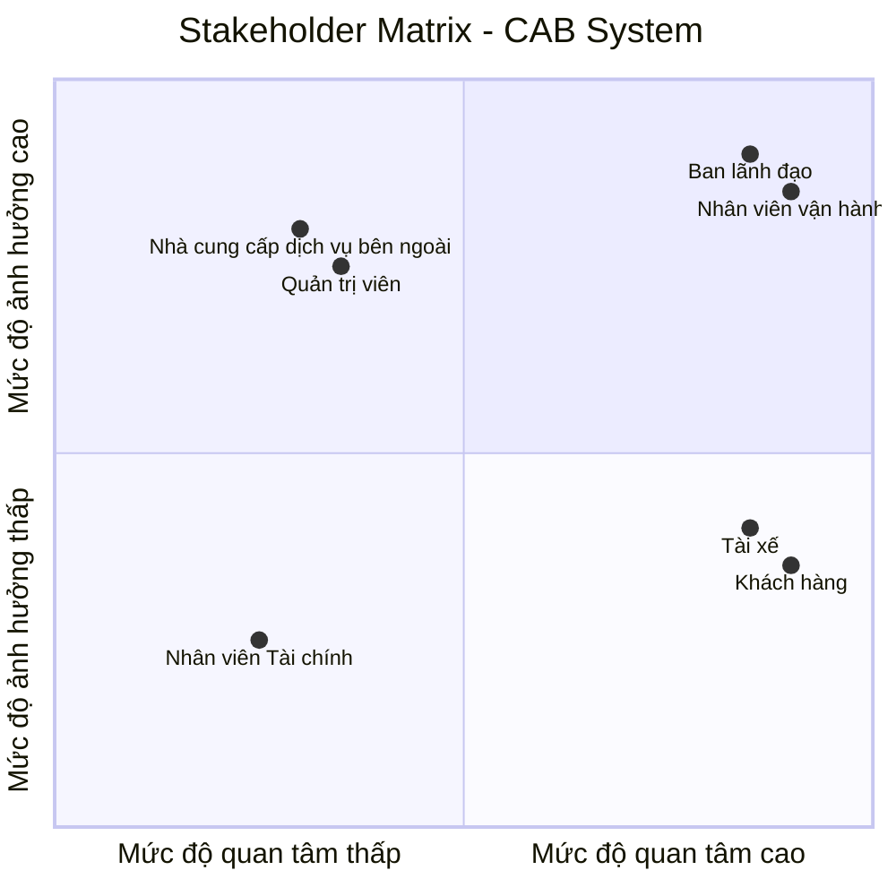

# 23630811_VOTHIMYXUYEN_CABSYSTEM
## BƯỚC 1: HIỂU NGHIỆP VỤ, LÝ DO HỆ THỐNG CŨ KHÔNG ĐÁP ỨNG ĐƯỢC, GIẢI PHÁP MỚI, CÁC BÊN THAM GIA VÀ GIÁ TRỊ KINH DOANH

## 1. Bối cảnh nghiệp vụ và lý do hệ thống cũ không đáp ứng được

**Quy trình điều phối thủ công:**  
Khách hàng hiện tại chủ yếu đặt xe qua tổng đài hoặc một ứng dụng sơ khai; việc gán và tìm tài xế phải làm thủ công, gây độ trễ lớn và dễ sai sót.

**Trải nghiệm khách hàng còn hạn chế:**  
Khách hàng không thể theo dõi trực quan vị trí thời gian thực của xe, trạng thái chuyến đi hoặc thời gian dự kiến tài xế đến.

**Quản lý dữ liệu thanh toán phân tán:**  
Dữ liệu thanh toán chưa được lưu trữ tập trung, thiếu khả năng kết nối cổng thanh toán trực tuyến bảo mật và linh hoạt.

**Khả năng mở rộng kém (Scalability kém):**  
Hệ thống không đáp ứng được khi lưu lượng khách hàng và tài xế tăng cao vào giờ cao điểm, gây nghẽn và khó phát triển thêm tính năng mới.

## 2. Giải pháp mới và hệ thống mới (Nền tảng CAB System)

**Tự động hóa hoàn toàn quy trình:**  
Xây dựng nền tảng CAB thông minh tự động kết nối cuốc xe theo định vị GPS, đề xuất tài xế phù hợp gần nhất, tự động chuyển lượt khi tài xế từ chối và tính cước tự động.

**Kiến trúc module hóa độc lập:**  
Hệ thống phân tách thành các module riêng biệt như Đặt chuyến, Định vị, Thanh toán, Thông báo và Quản trị; đảm bảo sự cố ở một module không làm tê liệt toàn bộ nền tảng.

## 3. Các đối tượng tham gia hệ thống

**Khách hàng:**  
Đăng ký/đăng nhập tài khoản, nhập điểm đón/đến, chọn loại dịch vụ xe, tạo yêu cầu đặt xe, theo dõi lộ trình trực tiếp, thanh toán và đánh giá tài xế sau chuyến.

**Tài xế:**  
Đăng ký hồ sơ và phương tiện, bật/tắt trạng thái sẵn sàng, nhận hoặc từ chối cuốc xe, cập nhật trạng thái di chuyển và truyền tọa độ vị trí theo thời gian thực.

**Nhân viên vận hành:**  
Sử dụng cổng thông tin quản trị để giám sát các chuyến đi đang diễn ra, kiểm tra trạng thái hoạt động của tài xế và hỗ trợ xử lý sự cố cuốc xe.

**Quản trị hệ thống:**  
Quản lý phân quyền người dùng, cấu hình tham số hệ thống, giám sát an ninh dữ liệu và lưu vết nhật ký hệ thống.

**Ban lãnh đạo:**  
Khai thác các báo cáo tổng hợp về doanh thu, số lượng cuốc hoàn thành, tỷ lệ hủy chuyến và hiệu suất vận hành của đội ngũ tài xế.

**Hệ thống bên thứ ba:**  
Cổng thanh toán điện tử trung gian, dịch vụ bản đồ số (Map API) và hạ tầng gửi thông báo (Push/SMS).

## 4. Giá trị kinh doanh của hệ thống mới

**Tối ưu chi phí và nguồn lực vận hành:**  
Giảm thiểu tối đa sự can thiệp thủ công từ tổng đài viên, tự động hóa quy trình ghép cuốc giúp tối ưu chi phí nhân sự.

**Gia tăng năng lực cạnh tranh và doanh thu:**  
Cho phép phục vụ số lượng lớn chuyến đi cùng lúc, hỗ trợ mở rộng nhanh chóng các loại hình dịch vụ vận chuyển mới.

**Nâng cao sự hài lòng và giữ chân khách hàng:**  
Minh bạch lộ trình, giá cước và rút ngắn thời gian chờ xe; đảm bảo an toàn tuyệt đối cho dữ liệu thông tin cá nhân và giao dịch.
## BƯỚC 2: XÁC ĐỊNH STAKEHOLDER, VAI TRÒ VÀ THIẾT LẬP STAKEHOLDER MATRIX
| STT | Stakeholder | Vai trò |
|:---:|---|---|
| 1 | **Ban lãnh đạo** | Định hướng chiến lược, phê duyệt ngân sách và theo dõi hiệu quả hoạt động của hệ thống. |
| 2 | **Khách hàng** | Đặt chuyến, thanh toán và theo dõi hành trình. |
| 3 | **Tài xế** | Nhận chuyến, thực hiện di chuyển và cập nhật trạng thái chuyến đi. |
| 4 | **Nhân viên vận hành** | Theo dõi cuốc xe, quản lý hoạt động tài xế và xử lý sự cố, khiếu nại khách hàng. |
| 5 | **Quản trị viên** | Phân tích yêu cầu, thiết kế, phát triển, kiểm thử và bảo trì hệ thống. |
| 6 | **Nhân viên Tài chính** | Đối soát giao dịch, theo dõi doanh thu và quản lý dữ liệu thanh toán. |
| 7 | **Nhà cung cấp dịch vụ bên ngoài (Payment Gateway & Map Providers)** | Xử lý thanh toán trực tuyến và cung cấp dịch vụ bản đồ, định vị. |

## 3. Ma trận Stakeholder Matrix (Phân loại theo Mức độ ảnh hưởng và Quan tâm)


## BƯỚC 3: MỤC ĐÍCH NGHIỆP VỤ

**1. Tự động hóa toàn diện quy trình điều phối & kết nối cuốc xe**

* Chuyển đổi hoàn toàn từ mô hình đặt xe thủ công qua tổng đài sang thuật toán điều phối tự động dựa trên tọa độ vị trí thời gian thực (GPS), độ sẵn sàng và khoảng cách gần nhất của tài xế.
* Tối ưu hóa thời gian chờ đợi của khách hàng và thời gian phản hồi cuốc xe của tài xế, giảm tải chi phí và nhân lực vận hành.

**2. Đáp ứng tải lớn và năng lực mở rộng phục vụ quy mô cao**

* Phục vụ đồng thời số lượng lớn khách hàng và tài xế trong các khung giờ cao điểm mà không gây nghẽn hoặc gián đoạn dịch vụ.
* Đảm bảo tính sẵn sàng cao thông qua kiến trúc module độc lập; lỗi phát sinh ở một thành phần riêng lẻ không làm ảnh hưởng đến toàn bộ chu trình đặt xe.

**3. Đa dạng hóa và bảo mật phương thức thanh toán**

* Hỗ trợ song song cả hai hình thức thanh toán linh hoạt: tiền mặt trực tiếp cho tài xế và thanh toán điện tử (thẻ ngân hàng, ví điện tử) qua cổng thanh toán trung gian.
* Đảm bảo an toàn bảo mật tuyệt đối: tích hợp thanh toán qua bên thứ ba và không lưu trữ thông tin thẻ hoặc tài khoản nhạy cảm trực tiếp trên hệ thống.

**4. Minh bạch trải nghiệm và nâng cao chất lượng dịch vụ**

* Giúp khách hàng chủ động theo dõi toàn bộ hành trình, vị trí thực tế của xe, thời gian dự kiến đón và biết trước giá cước ước tính trước khi xác nhận đặt.
* Cung cấp cơ chế đánh giá sao, nhận xét chất lượng tài xế sau mỗi chuyến đi để duy trì chất lượng dịch vụ đồng đều.

**5. Chuẩn hóa & tập trung hóa dữ liệu phục vụ quản trị, ra quyết định**

* Quản lý tập trung hồ sơ khách hàng, đối tác tài xế, thông tin phương tiện và lịch sử toàn bộ các chuyến đi/giao dịch.
* Cung cấp số liệu báo cáo thời gian thực cho Ban lãnh đạo về doanh thu, số lượng cuốc hoàn thành, tỷ lệ hủy chuyến và hiệu suất hoạt động để hoạch định chiến lược kinh doanh.

# BƯỚC 4: XÁC ĐỊNH PHẠM VI DỰ ÁN

## 1. Mục tiêu phạm vi

Trong thời gian **7 tuần**, dự án tập trung xây dựng hệ thống **CAB System** ở mức cơ bản, đáp ứng các chức năng cần thiết để hệ thống có thể vận hành như một hệ thống đặt xe trực tuyến.

## 2. Các module trong phạm vi dự án

### Module 1: Xác thực

- Đăng ký tài khoản.
- Đăng nhập.
- Đăng xuất.
- Xác thực tài khoản.
- Mã hóa mật khẩu.
- Phân quyền theo vai trò.

### Module 2: Quản lý người dùng

- Quản lý thông tin tài khoản.
- Cập nhật thông tin cá nhân.
- Quản lý trạng thái tài khoản.
- Quản lý vai trò người dùng.

Các vai trò chính:

- Khách hàng.
- Tài xế.
- Nhân viên Vận hành & Chăm sóc khách hàng.
- Quản trị hệ thống.

### Module 3: Quản lý tài xế

- Quản lý thông tin tài xế.
- Quản lý thông tin phương tiện.
- Cập nhật trạng thái sẵn sàng nhận chuyến.
- Tiếp nhận chuyến.
- Từ chối chuyến.

### Module 4: Quản lý đặt xe

- Nhập điểm đón.
- Nhập điểm đến.
- Chọn loại xe.
- Xem giá cước.
- Tạo yêu cầu đặt xe.
- Tìm và phân bổ tài xế.
- Hủy chuyến.

### Module 5: Quản lý chuyến đi

- Quản lý trạng thái chuyến.
- Xác nhận tài xế nhận chuyến.
- Cập nhật trạng thái:
  - Đã nhận chuyến.
  - Đã đến điểm đón.
  - Đã đón khách.
  - Đang di chuyển.
  - Hoàn thành chuyến.
- Theo dõi chuyến đi.

### Module 6: Quản lý bản đồ và định vị

- Xác định vị trí khách hàng.
- Xác định vị trí tài xế.
- Hiển thị điểm đón và điểm đến.
- Hiển thị vị trí tài xế trên bản đồ.
- Theo dõi vị trí tài xế trong quá trình di chuyển.

### Module 7: Quản lý thanh toán

- Thanh toán bằng tiền mặt.
- Thanh toán trực tuyến.
- Ghi nhận trạng thái thanh toán.
- Lưu thông tin giao dịch.

### Module 8: Quản lý lịch sử và đánh giá

- Xem lịch sử chuyến đi.
- Xem chi tiết chuyến đi.
- Xem chi phí chuyến đi.
- Đánh giá tài xế.
- Lưu nhận xét và số sao.

### Module 9: Quản trị hệ thống

- Quản lý tài khoản người dùng.
- Quản lý tài khoản tài xế.
- Quản lý chuyến đi.
- Theo dõi trạng thái hoạt động của hệ thống.
- Tra cứu thông tin và lịch sử.

---

## 3. Các đối tượng dữ liệu chính

Hệ thống quản lý các đối tượng dữ liệu cơ bản:

| Đối tượng | Nội dung quản lý |
|:---:|---|
| **Người dùng** | Tài khoản, thông tin cá nhân và vai trò |
| **Tài xế** | Thông tin tài xế và trạng thái hoạt động |
| **Phương tiện** | Loại xe, biển số và thông tin phương tiện |
| **Chuyến xe** | Điểm đón, điểm đến, trạng thái và giá cước |
| **Thanh toán** | Phương thức và trạng thái thanh toán |
| **Đánh giá** | Số sao và nhận xét của khách hàng |

---

## 4. Phạm vi quy trình chính

Hệ thống cần đảm bảo thực hiện được quy trình đặt xe cơ bản:

**Bước 1:** Khách hàng đăng nhập hệ thống.

**Bước 2:** Khách hàng nhập điểm đón và điểm đến.

**Bước 3:** Hệ thống tính và hiển thị giá cước.

**Bước 4:** Khách hàng xác nhận đặt xe.

**Bước 5:** Hệ thống tìm tài xế phù hợp.

**Bước 6:** Tài xế nhận chuyến.

**Bước 7:** Khách hàng theo dõi trạng thái và vị trí tài xế.

**Bước 8:** Tài xế thực hiện chuyến và cập nhật trạng thái.

**Bước 9:** Tài xế hoàn thành chuyến.

**Bước 10:** Khách hàng thanh toán.

**Bước 11:** Hệ thống lưu lịch sử chuyến.

**Bước 12:** Khách hàng đánh giá tài xế.

---
*Đăng nhập → Đặt xe → Chọn loại xe → Xác nhận chuyến → Tài xế nhận chuyến → Theo dõi chuyến → Hoàn thành chuyến → Thanh toán → Xem lịch sử → Đánh giá tài xế.*
---

# 5. Kế hoạch thực hiện trong 7 tuần
| Tuần | Nội dung thực hiện | Kết quả cần đạt |
|:---:|---|---|
| **Tuần 1** | Phân tích yêu cầu, xác định phạm vi, thiết kế cơ sở dữ liệu và kiến trúc hệ thống. | Hoàn thiện yêu cầu, sơ đồ nghiệp vụ, cơ sở dữ liệu và thiết kế tổng thể. |
| **Tuần 2** | Xây dựng **Module Xác thực** và **Module Quản lý người dùng**. | Người dùng có thể đăng ký, đăng nhập, đăng xuất và được phân quyền. |
| **Tuần 3** | Xây dựng **Module Quản lý tài xế** và **Module Quản lý phương tiện**. | Tài xế có hồ sơ, phương tiện và trạng thái sẵn sàng nhận chuyến. |
| **Tuần 4** | Xây dựng **Module Quản lý đặt xe** và **Module Quản lý chuyến đi**. | Khách hàng có thể đặt xe và tài xế có thể nhận, cập nhật chuyến. |
| **Tuần 5** | Xây dựng **Module Quản lý bản đồ và định vị**. | Hiển thị vị trí, điểm đón, điểm đến và theo dõi vị trí tài xế. |
| **Tuần 6** | Xây dựng **Module Quản lý thanh toán**, **Module Lịch sử & Đánh giá** và **Module Quản trị hệ thống**. | Hoàn thành các chức năng thanh toán, lịch sử, đánh giá và quản trị cơ bản. |
| **Tuần 7** | Tích hợp toàn bộ module, kiểm thử, sửa lỗi và hoàn thiện hệ thống. | Hệ thống hoạt động hoàn chỉnh theo quy trình đặt xe trực tuyến cơ bản. |

# BƯỚC 5: CHUYỂN YÊU CẦU NGHIỆP VỤ (BUSINESS REQUIREMENTS) THÀNH YÊU CẦU HỆ THỐNG
## Quy trình nghiệp vụ: Đặt xe trực tuyến
### 1. Khách hàng đăng nhập và đặt xe
**Yêu cầu nghiệp vụ:**  
Khách hàng có thể đăng nhập và đặt xe trực tuyến.
**Hệ thống cần:**
- Cho phép khách hàng đăng nhập.
- Cho phép khách hàng nhập điểm đón.
- Cho phép khách hàng nhập điểm đến.
- Cho phép khách hàng chọn loại xe.
- Hiển thị giá cước dự kiến.
- Cho phép khách hàng xác nhận đặt xe.
### 2. Hệ thống tìm tài xế
**Yêu cầu nghiệp vụ:**  
Sau khi khách hàng xác nhận đặt xe, hệ thống tìm tài xế phù hợp để thực hiện chuyến đi.
**Hệ thống cần:**
- Kiểm tra các tài xế đang sẵn sàng.
- Xác định tài xế phù hợp dựa trên vị trí.
- Gửi yêu cầu chuyến đến tài xế.
- Cho phép tài xế nhận hoặc từ chối chuyến.
- Nếu tài xế từ chối hoặc không phản hồi, hệ thống tiếp tục tìm tài xế khác.
- Thông báo cho khách hàng khi có tài xế nhận chuyến.
### 3. Tài xế thực hiện chuyến đi
**Yêu cầu nghiệp vụ:**  
Tài xế có thể nhận và thực hiện chuyến xe.
**Hệ thống cần:**
- Hiển thị thông tin chuyến cho tài xế.
- Hiển thị điểm đón và điểm đến.
- Cho phép tài xế xác nhận nhận chuyến.
- Cho phép tài xế cập nhật trạng thái chuyến:
  - Đã nhận chuyến.
  - Đã đến điểm đón.
  - Đã đón khách.
  - Đang di chuyển.
  - Hoàn thành chuyến.
### 4. Khách hàng theo dõi chuyến đi
**Yêu cầu nghiệp vụ:**  
Khách hàng có thể theo dõi tình trạng và vị trí tài xế trong quá trình thực hiện chuyến.
**Hệ thống cần:**
- Hiển thị thông tin tài xế.
- Hiển thị vị trí tài xế trên bản đồ.
- Cập nhật trạng thái chuyến.
- Cho phép khách hàng theo dõi quá trình di chuyển.
- Thông báo cho khách hàng khi tài xế đến điểm đón.
- Thông báo khi chuyến đi hoàn thành.
### 5. Thanh toán chuyến đi
**Yêu cầu nghiệp vụ:**  
Khách hàng thanh toán cước phí sau khi hoàn thành chuyến đi hoặc theo phương thức thanh toán đã lựa chọn.
**Hệ thống cần:**
- Tính và hiển thị cước phí chuyến đi.
- Cho phép thanh toán bằng tiền mặt.
- Cho phép thanh toán trực tuyến.
- Ghi nhận trạng thái thanh toán.
- Lưu thông tin giao dịch.
### 6. Hoàn thành chuyến và đánh giá
**Yêu cầu nghiệp vụ:**  
Sau khi chuyến đi hoàn thành, khách hàng có thể đánh giá tài xế.
**Hệ thống cần:**
- Xác nhận chuyến đi đã hoàn thành.
- Lưu thông tin chuyến đi.
- Cho phép khách hàng đánh giá tài xế bằng số sao.
- Cho phép khách hàng nhập nhận xét.
- Lưu kết quả đánh giá
### 7. Lưu lịch sử chuyến đi
**Yêu cầu nghiệp vụ:**  
Khách hàng và tài xế có thể xem lại lịch sử các chuyến đã thực hiện.
**Hệ thống cần:**
- Lưu thông tin chuyến đi.
- Lưu thông tin điểm đón và điểm đến.
- Lưu thông tin tài xế và khách hàng.
- Lưu cước phí và trạng thái thanh toán.
- Cho phép khách hàng xem lịch sử chuyến.
- Cho phép tài xế xem lịch sử chuyến đã thực hiện.
# BƯỚC 6: Phân rã chức năng ()
# BƯỚC 6: PHÂN RÃ CHỨC NĂNG – FUNCTIONAL REQUIREMENTS

## 1. Chức năng Đăng ký và xác thực tài khoản

### FR-01: Đăng ký tài khoản
- Hệ thống cho phép khách hàng đăng ký tài khoản bằng thông tin cá nhân.
- Hệ thống kiểm tra thông tin đăng ký hợp lệ.
- Hệ thống không cho phép đăng ký trùng thông tin tài khoản.

### FR-02: Đăng nhập
- Hệ thống cho phép người dùng đăng nhập bằng tài khoản và mật khẩu.
- Hệ thống kiểm tra thông tin xác thực.
- Hệ thống xác định vai trò của người dùng sau khi đăng nhập.

### FR-03: Phân quyền người dùng
- Hệ thống phân quyền theo vai trò:
  - Khách hàng.
  - Tài xế.
  - Nhân viên vận hành.
  - Quản trị viên.
  - Nhân viên tài chính.

---

## 2. Chức năng Đặt xe

### FR-04: Nhập thông tin chuyến đi
- Hệ thống cho phép khách hàng nhập điểm đón.
- Hệ thống cho phép khách hàng nhập điểm đến.
- Hệ thống xác định khoảng cách giữa điểm đón và điểm đến.

### FR-05: Chọn loại xe
- Hệ thống hiển thị các loại xe đang được cung cấp.
- Khách hàng có thể lựa chọn loại xe phù hợp.
- Hệ thống chỉ tìm tài xế có phương tiện phù hợp với loại xe khách hàng đã chọn.

### FR-06: Tính giá cước
- Hệ thống xác định giá cước dựa trên loại xe và quãng đường.
- Hệ thống hiển thị giá cước dự kiến cho khách hàng.
- Khách hàng xác nhận giá trước khi đặt xe.

### FR-07: Xác nhận đặt xe
- Hệ thống tạo yêu cầu đặt xe sau khi khách hàng xác nhận.
- Hệ thống lưu thông tin điểm đón, điểm đến, loại xe và giá cước dự kiến.
- Hệ thống chuyển yêu cầu sang chức năng tìm tài xế.

---

## 3. Chức năng Tìm và phân bổ tài xế

### FR-08: Xác định vị trí tài xế
- Hệ thống lấy vị trí hiện tại của các tài xế.
- Hệ thống chỉ xem xét các tài xế đang **sẵn sàng nhận chuyến**.

### FR-09: Lọc tài xế theo loại xe
- Hệ thống kiểm tra loại phương tiện của tài xế.
- Hệ thống loại bỏ các tài xế không phù hợp với loại xe khách hàng đã chọn.

### FR-10: Lọc tài xế theo trạng thái
- Hệ thống chỉ lựa chọn tài xế có trạng thái **Đang sẵn sàng**.
- Không lựa chọn tài xế đang thực hiện chuyến.
- Không lựa chọn tài xế đang ngoại tuyến.

### FR-11: Tính khoảng cách
- Hệ thống tính khoảng cách từ tài xế đến điểm đón.
- Hệ thống sắp xếp danh sách tài xế theo khoảng cách.

### FR-12: Ưu tiên tài xế
- Hệ thống ưu tiên tài xế phù hợp dựa trên:
  1. Đúng loại xe.
  2. Đang sẵn sàng.
  3. Khoảng cách gần điểm đón.
  4. Điểm đánh giá cao hơn khi các điều kiện khác tương đương.

### FR-13: Gửi yêu cầu nhận chuyến
- Hệ thống gửi thông tin chuyến đến tài xế được ưu tiên.
- Tài xế nhận được thông tin điểm đón, điểm đến và loại xe.

### FR-14: Chờ tài xế xác nhận
- Hệ thống chờ phản hồi của tài xế trong một khoảng thời gian quy định.
- Nếu tài xế **chấp nhận**, hệ thống xác nhận tài xế cho chuyến.
- Nếu tài xế **từ chối**, hệ thống chuyển sang tài xế tiếp theo.
- Nếu tài xế **không phản hồi**, hệ thống xem như yêu cầu đã hết thời gian và tiếp tục tìm tài xế khác.

### FR-15: Tiếp tục tìm tài xế
- Hệ thống tiếp tục tìm tài xế phù hợp khi tài xế trước từ chối hoặc không phản hồi.
- Hệ thống không gửi lại yêu cầu cho tài xế đã từ chối chuyến.
- Nếu không còn tài xế phù hợp, hệ thống thông báo cho khách hàng.

---

## 4. Chức năng Quản lý chuyến đi

### FR-16: Xác nhận tài xế
- Hệ thống xác nhận tài xế sau khi tài xế chấp nhận chuyến.
- Hệ thống cập nhật trạng thái chuyến thành **Đã nhận tài xế**.
- Hệ thống thông báo thông tin tài xế cho khách hàng.

### FR-17: Cập nhật trạng thái chuyến
Hệ thống cho phép tài xế cập nhật:

**Đã nhận chuyến → Đã đến điểm đón → Đã đón khách → Đang di chuyển → Hoàn thành chuyến**

### FR-18: Theo dõi chuyến đi
- Hệ thống cập nhật vị trí tài xế.
- Hệ thống hiển thị vị trí tài xế trên bản đồ.
- Khách hàng có thể theo dõi trạng thái chuyến.

### FR-19: Hủy chuyến
- Hệ thống cho phép khách hàng hủy chuyến theo điều kiện quy định.
- Hệ thống cập nhật trạng thái chuyến thành **Đã hủy**.
- Hệ thống thông báo kết quả hủy chuyến.

---

## 5. Chức năng Thanh toán

### FR-20: Chọn phương thức thanh toán
Khách hàng có thể chọn:
- Tiền mặt.
- Thanh toán trực tuyến.

### FR-21: Thanh toán
- Hệ thống ghi nhận số tiền cần thanh toán.
- Nếu thanh toán tiền mặt, hệ thống ghi nhận trạng thái thanh toán sau khi chuyến hoàn thành.
- Nếu thanh toán trực tuyến, hệ thống gửi yêu cầu đến cổng thanh toán.

### FR-22: Cập nhật trạng thái thanh toán
Hệ thống nhận kết quả thanh toán và cập nhật:
- Thanh toán thành công.
- Thanh toán thất bại.
- Chưa thanh toán.

---

## 6. Chức năng Đánh giá tài xế

### FR-23: Đánh giá chuyến đi
- Sau khi chuyến hoàn thành, hệ thống cho phép khách hàng đánh giá tài xế.
- Khách hàng có thể chọn số sao.
- Khách hàng có thể nhập nhận xét.

### FR-24: Lưu đánh giá
- Hệ thống lưu đánh giá gắn với chuyến đi.
- Hệ thống cập nhật điểm đánh giá của tài xế.

---

## 7. Chức năng Lịch sử chuyến đi

### FR-25: Lưu lịch sử
- Hệ thống lưu thông tin các chuyến đã thực hiện.

### FR-26: Xem lịch sử
- Khách hàng có thể xem lịch sử chuyến đi của mình.
- Tài xế có thể xem lịch sử các chuyến đã nhận.

Thông tin lịch sử gồm:
- Mã chuyến.
- Điểm đón.
- Điểm đến.
- Loại xe.
- Tài xế.
- Giá cước.
- Phương thức thanh toán.
- Trạng thái chuyến.
- Thời gian thực hiện.

---

## 8. Chức năng Quản lý tài xế

### FR-27: Quản lý trạng thái tài xế

Hệ thống quản lý các trạng thái:

**Ngoại tuyến → Sẵn sàng → Đang nhận chuyến → Đang thực hiện chuyến → Hoàn thành**

### FR-28: Quản lý thông tin tài xế
- Lưu thông tin cá nhân tài xế.
- Lưu thông tin giấy phép lái xe.
- Lưu thông tin phương tiện.
- Lưu loại xe.
- Lưu điểm đánh giá.

---

## 9. Chức năng Quản trị hệ thống

### FR-29: Quản lý người dùng
- Xem danh sách người dùng.
- Thêm, sửa, khóa tài khoản.
- Quản lý vai trò người dùng.

### FR-30: Quản lý tài xế
- Xem danh sách tài xế.
- Kiểm tra thông tin tài xế.
- Quản lý trạng thái tài xế.
- Quản lý thông tin phương tiện.

### FR-31: Quản lý chuyến đi
- Xem danh sách chuyến.
- Tra cứu chuyến.
- Xem trạng thái chuyến.
- Xem thông tin thanh toán.

---

## 10. Chức năng Đối soát tài chính

### FR-32: Quản lý giao dịch
- Hệ thống lưu thông tin các giao dịch thanh toán.
- Nhân viên tài chính có thể tra cứu giao dịch.

### FR-33: Đối soát doanh thu
- Hệ thống tổng hợp doanh thu từ các chuyến hoàn thành.
- Phân loại doanh thu theo phương thức thanh toán.
- Cho phép nhân viên tài chính kiểm tra trạng thái thanh toán.

---

# QUY TRÌNH CHỨC NĂNG CỐT LÕI

```text
Khách hàng đặt xe
        ↓
Xác định điểm đón + loại xe
        ↓
Lấy danh sách tài xế đang sẵn sàng
        ↓
Lọc theo loại xe
        ↓
Tính khoảng cách đến điểm đón
        ↓
Sắp xếp tài xế phù hợp
        ↓
Ưu tiên tài xế gần + đánh giá tốt
        ↓
Gửi yêu cầu cho tài xế
        ↓
   Tài xế phản hồi?
      ↙       ↘
   Nhận       Từ chối/
    ↓        không phản hồi
Xác nhận        ↓
tài xế      Tìm tài xế tiếp theo
    ↓
Bắt đầu chuyến
    ↓
Hoàn thành
    ↓
Thanh toán
    ↓
Đánh giá

# BƯỚC 7: VẼ USECASE, 
# BƯỚC 7: ĐẶC TẢ USECASE
#BƯỚC 9: PHÂN TÍCH QUY TRÌNH NGHIỆP VỤ (BUSINESS PROJECT) DÙNG SƠ ĐỒ GÌ VỄ
# BƯỚC 10 PHÂN TÍCH QUY TẮC NGHIỆP BUSINESS RULES
NHỮNG TÀI XẾ NÀO SẴN SÀNG MỚI ĐƯỢC VÀ RATING CAO MỚI ƯU TIÊN NHẬN KHÁCH TRƯỚC  

